# 🚀 k8soperation · Kubernetes 多集群运维与 CI/CD 控制平台

一个基于 **Go + Gin + Gorm + Zap + Redis Stream + client-go** 构建的企业级 Kubernetes 多集群运维与发布控制平台后端系统。

平台以 **Kubernetes 控制平面（Control Plane）架构思想** 为核心，构建统一的 Kubernetes 运维与发布控制中心，支撑生产级高频交付与规模化运维场景。

------

## 🎯 平台定位

围绕以下核心能力构建：

- 🌐 **多集群资源治理**
- 🔄 **CI/CD 发布编排**
- 🔐 **RBAC 精细化权限控制**
- ♻ **声明式自动化运维**
- ⚙ **发布状态机与一致性控制**

通过平台化控制能力，实现从“人工 kubectl 运维”向“自动化、可审计、可回滚”的企业级运维体系升级。

------

## 🏗 架构核心思想

平台遵循 Control Plane 设计理念，将：

- 构建（CI）
- 部署（CD）
- 资源治理
- 权限控制
- 一致性保障

统一纳入平台控制域，实现：

- 构建与部署解耦
- 多集群统一管理
- 发布流程可追踪
- 状态迁移可控
- 运维操作可审计
## 🔗 项目地址

- Gitee（主仓库）：https://gitee.com/jay-kim/k8s_operation
- GitHub（镜像仓库）：https://github.com/jay-codemine/k8s_operation

> 📦 **配套 AppConfig Operator（Kubebuilder 项目）请访问：**
>  👉 https://gitee.com/jay-kim/appconfig-operator

系统支持多集群管理、事件聚合、滚动升级、镜像更新、扩缩容、Pod 日志流、节点驱逐/隔离、PVC 扩容等能力，是构建企业 K8s 管控平台的优秀后端基础设施。

------

## 🏗️ 系统架构

K8s Operation 是一个面向多集群的 Kubernetes 运维管理平台，
提供统一的 API 接入、多集群上下文管理、CRD & Operator 控制平面能力，
以及完整的可观测与审计能力。

整体架构如下：


> 📌 **系统架构图地址（点击原始数据可放大查看）**：  
> https://gitee.com/jay-kim/k8s_operation/blob/master/docs/architecture.svg

## 📦 Kubernetes / client-go 版本兼容性

本项目基于：
- `k8s.io/client-go v0.34.2`

根据官方版本映射规则：
- client-go v0.34.x 对应 Kubernetes v1.34.x

由于 Kubernetes 对客户端有向后兼容策略，旧版本 Kubernetes 也可以正常访问绝大多数 API：
- ✅ 推荐：Kubernetes v1.34.x
- 👍 支持：Kubernetes v1.28.x ~ v1.33.x（大多数功能均正常）
- ⚠ 低于 v1.25 可能存在部分 API 不支持或弃用问题

> 建议生产环境尽量使用与 client-go 主版本号一致的 Kubernetes 版本，以获得最佳兼容性。

## 🖥️ 系统界面展示

> 以下为真实系统运行截图

---

### 🔹 核心界面预览

<p align="center">
  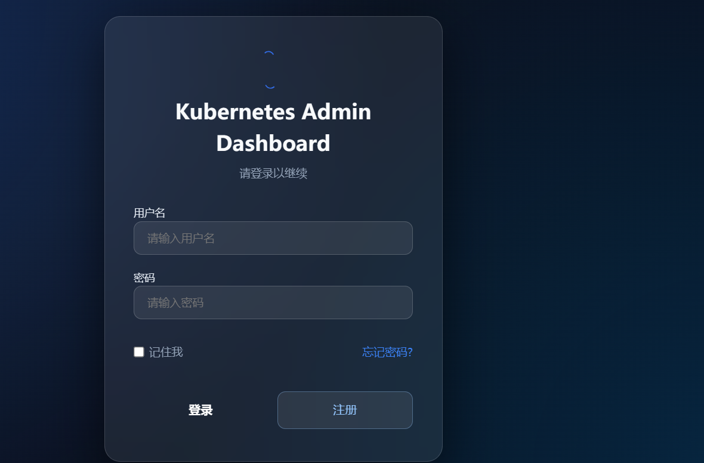
</p>

<p align="center">
  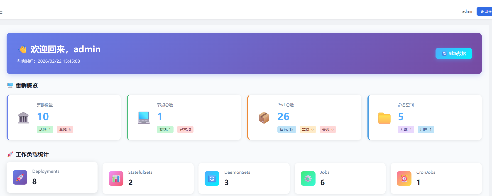
</p>

<p align="center">
  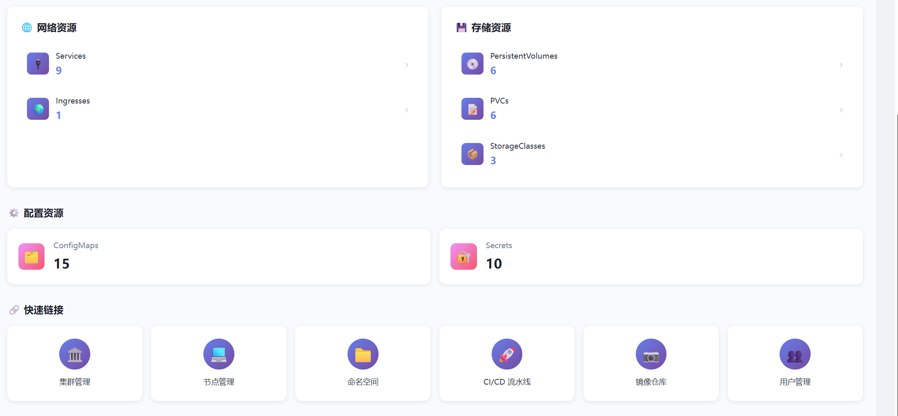
</p>

---

<details>
<summary>📂 点击展开查看全部界面截图（共 13 张）</summary>

<br/>

<p align="center">
  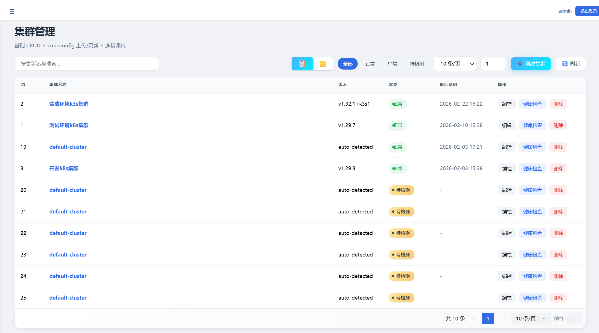
</p>

<p align="center">
  
</p>

<p align="center">
  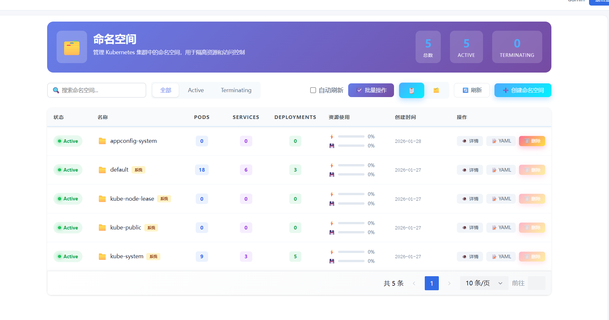
</p>

<p align="center">
  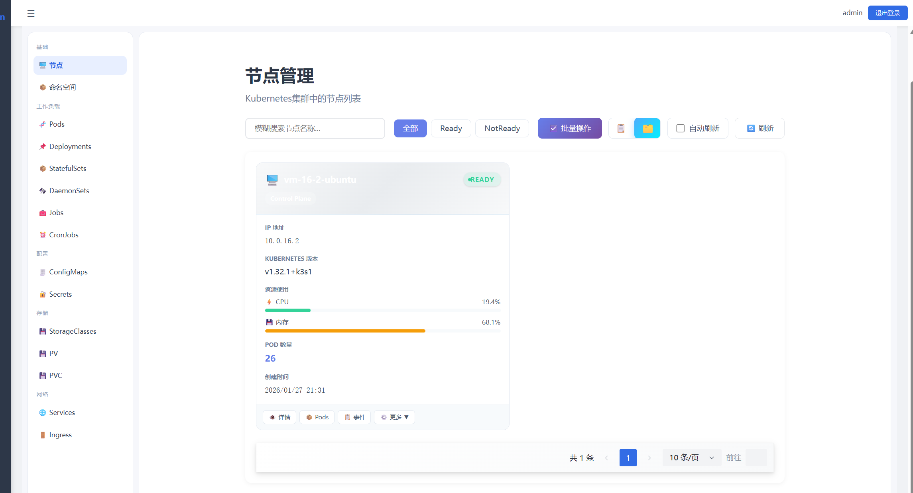
</p>

<p align="center">
  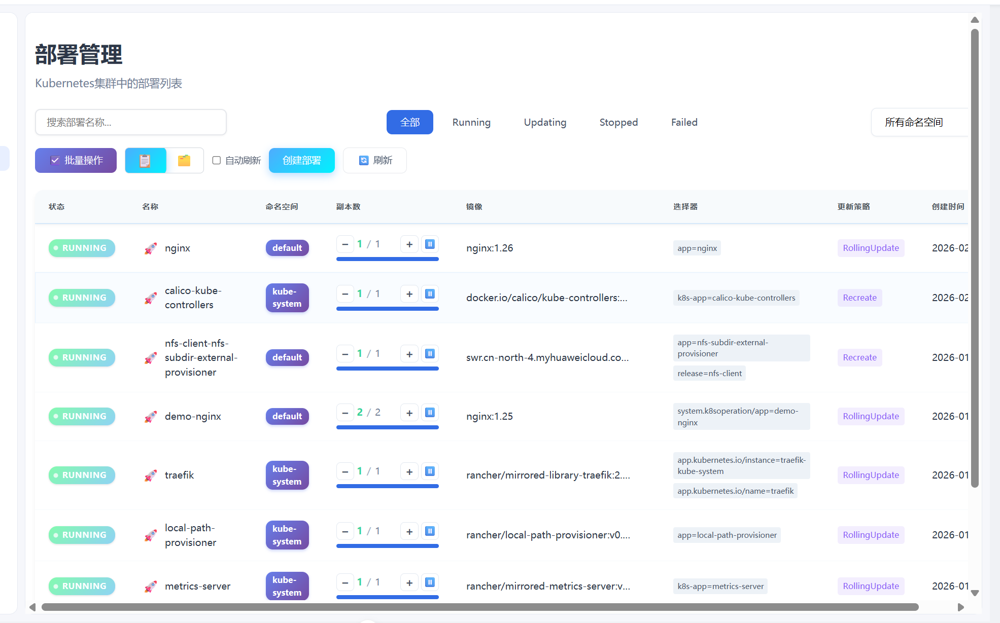
</p>

<p align="center">
  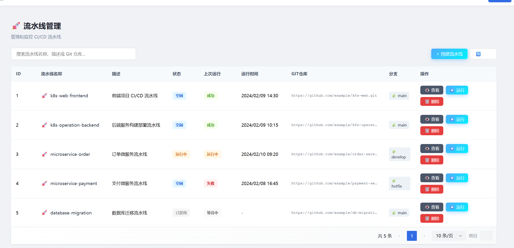
</p>

<p align="center">
  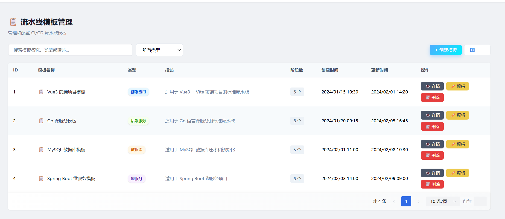
</p>

<p align="center">
  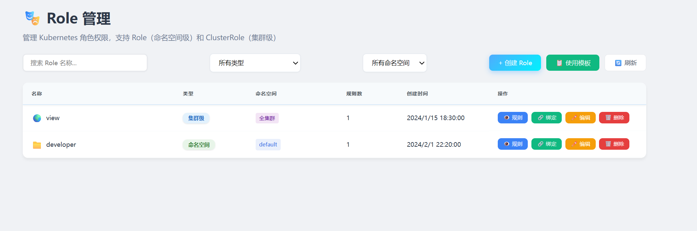
</p>

<p align="center">
  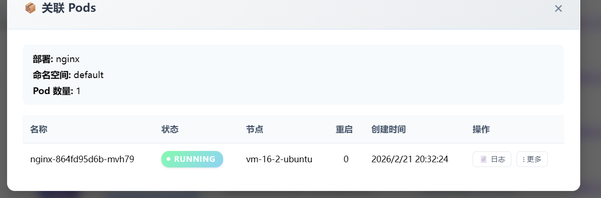
</p>

<p align="center">
  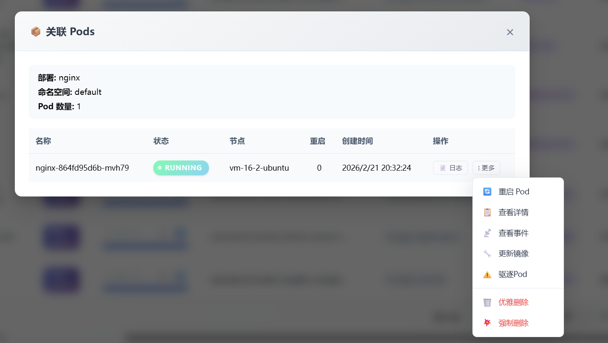
</p>

</details>

## ✨ 核心特性

### 🧩 系统通用能力

- 配置化加载（YAML / ENV）
- JWT 鉴权 + 刷新机制
- Zap 双日志系统（系统日志 / 业务日志）
- Swagger 在线 API 文档（支持 Standalone）
- 健康检查与优雅关闭
- 标准化控制器 / 服务 / DAO 分层
- 全局异常拦截（中间件）

------

## ☸ Kubernetes 高级能力（全部已实现）

### Deployment 管理

- CRUD、扩缩容、镜像更新、滚动升级
- 滚动重启、基于 ReplicaSet 的版本回滚
- Pods 列表、事件聚合、历史版本查询

### Pod 管理

- 列表、详情、日志（流式/非流）
- 镜像 Patch、事件查询、强制删除

### StatefulSet / DaemonSet

- CRUD、扩缩容、镜像更新
- ControllerRevision 回滚

### Service / Ingress

- CRUD
- Strategic / JSON Merge Patch
- TLS 配置、事件聚合

### Job / CronJob

- Job：创建 / 删除 / 状态查询
- CronJob：启停、删除、历史 Job 查询

### Secret / PVC / PV / ConfigMap / StorageClass

- 全生命周期管理
- PVC 扩容、PV ReclaimPolicy 修改
- ConfigMap Patch、StorageClass CRUD

### Node 高级管理

- Cordon / Uncordon
- Drain（驱逐可驱逐 Pod）
- Pod Evict（支持 gracePeriod）
- 节点 Metrics、Pods 列表

### Event 事件聚合

- Pod / Deploy / StatefulSet / Node 等资源
- 支持排障快速定位（Backoff、PullError、Unschedulable）

------

## 🧩 多集群管理

- 保存 kubeconfig
- 连通性检测
- 多集群切换（clusterId）
- 自动创建对应 client-go

适合企业多集群统一管控场景。

------

## 📦 项目结构（真实仓库对应）

```bash
k8soperation/
├── cmd/
├── configs/
├── docs/
│   ├── 📄 K8sOperation 后台系统部署文档.md   <--（部署文档）
├── global/
├── initialize/
├── internal/
│   ├── app/
│   ├── errorcode/
│   ├── health/
│   └── k8soperation/
├── pkg/
├── build/
└── storage/
```

------

## ⚙️ 快速启动

# 🗄️ 数据库初始化说明（k8soperation）

本文档用于说明 **k8soperation 后端系统** 的数据库初始化流程。

数据库主要用于：

- 平台用户管理
- Kubernetes 集群管理（多集群接入、状态维护等）

---

## 1️⃣ 数据库要求

- 数据库类型：**MySQL 8.0+**
- 字符集：`utf8mb4`
- 排序规则：`utf8mb4_0900_ai_ci`

> ⚠️ 不推荐使用 MySQL 5.7 及以下版本，可能存在字符集或索引兼容问题。

---

## 2️⃣ SQL 文件说明

当前目录包含以下 SQL 与文档：

```text
docs/sql/
├── README.md              # 数据库初始化说明（本文档）
├── k8s-platform.sql       # 初始化 SQL（DDL only）
└── migrate_history.md     # 数据库结构演进记录
```

### 📌 k8s-platform.sql

该脚本具备以下特性：

- **仅包含表结构（DDL）**
- **不包含任何业务数据（无 INSERT）**
- 使用 `CREATE DATABASE IF NOT EXISTS`
- 使用 `CREATE TABLE IF NOT EXISTS`
- **表已存在时不会删除或覆盖**（不会 DROP）

👉 适用于：

- 首次部署
- 二次部署
- 生产环境安全初始化

---

## 3️⃣ 初始化步骤（推荐）

### ① 执行初始化 SQL

```bash
mysql -h 127.0.0.1 -u root -p < docs/sql/k8s-platform.sql
```

执行内容包括：

- 创建数据库（如不存在）
- 创建 `user`、`kube_cluster` 表（如不存在）

---

### ② 验证结果

登录 MySQL 后执行：

```sql
USE `k8s-platform`;
SHOW TABLES;
```

应至少包含：

- `user`
- `kube_cluster`

---

## 4️⃣ 表说明

### 📘 user（用户表）

用于存储平台用户信息：

- 用户名（唯一）
- 密码（加密存储）
- 创建 / 修改 / 删除时间
- 逻辑删除标识（`is_del`）

---

### 📘 kube_cluster（Kubernetes 集群表）

用于管理接入平台的 Kubernetes 集群：

- 集群名称
- kubeconfig（Base64 编码）
- 集群版本
- 集群状态
- 最近一次健康检查时间与异常信息

该表是 **平台核心基础表之一**。

---

## 5️⃣ 数据库版本演进

数据库结构的变更记录维护在：

```text
docs/sql/migrate_history.md
```

如需升级数据库结构，请参考该文件，不建议直接在线修改表结构。

---

## 6️⃣ 注意事项

- 本项目采用 **逻辑删除（is_del）**
- 查询业务数据时需注意过滤已删除记录
- 数据库结构变更应通过迁移脚本统一管理


```bash
git clone https://gitee.com/jay-kim/k8s_operation.git
cd k8s_operation
make build
./bin/k8soperation
```

访问 Swagger：

```bash
http://localhost:8080/swagger
http://localhost:8080/swagger-standalone
```

------

## 📄 部署文档（强烈推荐阅读）

官方部署说明文档（包括 **后端服务** 与 **前端管理界面** 的部署方式）：

👉 **K8sOperation 后台系统部署文档（后端）**  
https://gitee.com/jay-kim/k8s_operation/blob/master/docs/📄%20K8sOperation%20后台系统部署文档.md

👉 **前端管理系统部署文档（k8s-web）**  
https://gitee.com/jay-kim/k8s_operation/blob/master/docs/%E5%89%8D%E7%AB%AF%E7%AE%A1%E7%90%86%E7%B3%BB%E7%BB%9F%E9%83%A8%E7%BD%B2%E6%96%87%E6%A1%A3.md

---

### 后端部署文档内容包括：

- 构建后端二进制
- Docker / Containerd 镜像构建
- 使用 Systemd 管理服务
- Kubernetes Deployment / Service 部署示例
- 参数说明与优化建议
- 生产环境目录规划

---

### 前端部署文档内容包括：

- 前端项目构建（Vite）
- 环境变量配置（API_BASE）
- Nginx 部署（SPA 路由支持）
- Docker 部署
- Kubernetes（Deployment / Service / Ingress）
- 与后端 API 对接说明

## 🔗 关联项目（推荐配套使用）

### 📘 AppConfig Operator

（Kubebuilder 开发，用于管理自定义资源 AppConfig）
👉 https://gitee.com/jay-kim/appconfig-operator

Operator → 管理 AppConfig CRD
k8soperation → 提供 HTTP API/Web 后台

两者解耦，便于独立演进。

------

## ⭐ Star / Watch / Fork

如果本项目对你有帮助，非常欢迎：

- ⭐ **Star**
- 👀 **Watch**
- 🍴 **Fork**

你的支持是我持续完善的最大动力！

------

## 📜 License

MIT License