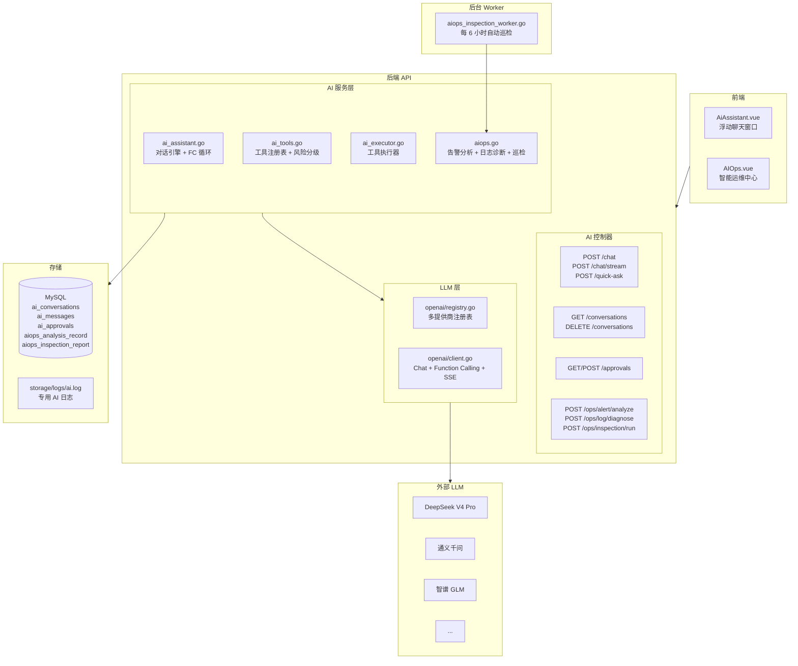
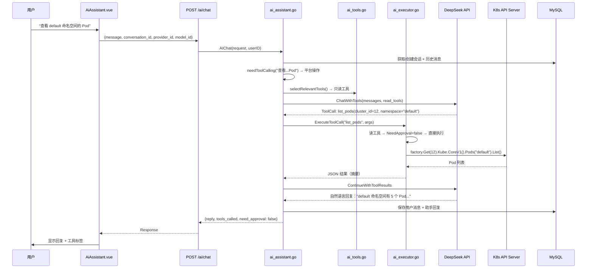

# AI 智能助手架构设计文档

> 版本: v1.0 | 更新时间: 2026-07-31

## 一、概述

平台内嵌 AI 智能助手，用户通过自然语言操作 Kubernetes 集群。基于 OpenAI 兼容接口 + Function Calling，支持多模型提供商、危险操作审批、AIOps 智能运维。

**设计原则**：AI 模块完全解耦，LLM 不可用时不影响平台核心功能。

```
用户自然语言
  "查看 default 命名空间的 Pod" / "扩容 nginx 到 5 个副本"
        │
        ▼
  LLM 意图识别（Function Calling）
        │
   ┌────┼────┐
   │    │    │
 查询  写操作  高危操作
 直接执行 审批  审批流程
```

### 两大子系统

| 子系统 | 说明 | 入口 |
|--------|------|------|
| **AI 助手** | 对话式 K8s 操作 + 工具调用 + 审批流 | 右下角悬浮按钮 |
| **AIOps 智能运维** | 告警分析、日志诊断、定时巡检 | 平台管理 → 智能运维中心 |

---

## 二、系统架构图



---

## 三、请求链路



---

## 四、LLM 多提供商架构

### 4.1 注册表 (`pkg/openai/registry.go`)

```
global.AIRegistry
  │
  ├── Provider "deepseek"
  │   ├── APIKey: sk-xxx
  │   ├── BaseURL: https://api.deepseek.com
  │   └── Models: [deepseek-v4-pro, deepseek-v4-pro:thinking]
  │
  ├── Provider "qwen"
  │   ├── APIKey: sk-xxx
  │   ├── BaseURL: https://dashscope.aliyuncs.com/compatible-mode/v1
  │   └── Models: [qwen-max, qwen-plus]
  │
  └── Provider "glm"
      └── ...
```

- 客户端按模型缓存，`sync.RWMutex` 线程安全
- APIKey 为空的提供商启动时自动跳过
- `ListProviders()` 返回元数据给前端，**永不暴露 APIKey**

### 4.2 客户端 (`pkg/openai/client.go`)

基于 `go-openai v1.41.2`，任何 OpenAI 兼容 API 均可用：

| 方法 | 用途 |
|------|------|
| `Chat()` | 普通对话（问候、通用问答） |
| `ChatWithTools()` | Function Calling（平台操作） |
| `ContinueWithToolResults()` | FC 多轮后继续 |
| `ChatStream()` | SSE 流式输出 |
| `AnalyzeIntent()` | JSON 意图识别 |

每次调用记录到 `storage/logs/ai.log`：模型、消息数、耗时、**Prompt/Completion/Total Tokens**。

---

## 五、工具调用系统

### 5.1 风险分级

| 级别 | 说明 | 审批 | 示例 |
|------|------|:---:|------|
| `read` | 只读查询 | 不需要 | `list_pods`, `get_deployment_detail`, `list_nodes` |
| `write` | 变更操作 | 需要 | `scale_deployment`, `restart_deployment`, `update_deployment_image` |
| `danger` | 删除操作 | 需要 | `delete_pod`, `delete_deployment`, `delete_service` |
| `critical` | 高危操作 | 需要 | `delete_namespace`, `drain_node` |

### 5.2 工具清单

**只读工具（直接执行，无需审批）：**

| 工具名 | 说明 |
|--------|------|
| `list_clusters` | 获取集群列表（无需参数，用于发现 cluster_id） |
| `list_namespaces` | 获取命名空间列表 |
| `list_pods` / `get_pod_detail` | Pod 列表 / 详情 |
| `list_deployments` / `get_deployment_detail` | Deployment 列表 / 详情 |
| `list_services` / `get_service_detail` | Service 列表 / 详情 |
| `list_nodes` / `get_node_detail` | Node 列表 / 详情 |
| `list_ingresses` | Ingress 列表 |
| `list_configmaps` | ConfigMap 列表 |
| `list_pvcs` | PVC 列表 |
| `list_pipelines` / `get_pipeline_detail` | CI/CD 流水线列表 / 详情 |

**写操作工具（创建审批，管理员通过后执行）：**

| 工具名 | 说明 |
|--------|------|
| `scale_deployment` | 扩缩容副本数 |
| `restart_deployment` | 滚动重启 |
| `rollback_deployment` | 回滚到指定 ReplicaSet |
| `update_deployment_image` | 更新容器镜像 |
| `cordon_node` | 调度/驱逐节点 |

**高危工具（强制审批）：**

| 工具名 | 风险 |
|--------|------|
| `delete_pod`, `delete_deployment`, `delete_service`, `delete_configmap`, `delete_ingress`, `delete_pvc` | danger |
| `delete_namespace`, `drain_node` | critical |

### 5.3 智能路由

```go
// 根据用户消息关键词选择工具子集
needToolCalling(message) → {
    删除意图 → 只发 delete_* + drain_node
    写操作   → 只发 write 工具
    其他     → 只发 read 工具（不提审批工具，省 token）
}
```

### 5.4 Function Calling 循环（最多 5 轮）

```
用户消息 → LLM 返回 tool_calls
  │
  ├── 读工具 → 立即执行 → 结果反馈 LLM
  │
  └── 写/危险工具 → 创建审批记录
       │
       ├── 等待管理员审批
       ├── 审批通过 → 异步 goroutine 执行
       ├── 审批拒绝 → 更新状态
       └── 超时 → 状态 = expired
```

### 5.5 执行器复用

AI 工具执行器调用**与手动 UI 相同的 Service 层方法**，无特殊权限：

```go
// ai_executor.go
func (s *Services) execListPods(ctx, args) {
    cli := factory.Get(ctx, clusterID)
    return s.KubePodList(ctx, cli, param)  // 复用同一个 Service 方法
}
```

---

## 六、AI 审批流程

### 6.1 状态机

```
        创建审批
           │
           ▼
       ┌──────┐
       │pending│
       └──┬───┘
          │
    ┌─────┼─────┐
    ▼     ▼     ▼
┌──────┐┌──────┐┌───────┐
│approved││rejected││expired│
└──┬───┘└──────┘└───────┘
   │
   ▼
异步执行 → success/failed
```

### 6.2 规则

- **审批管理员**：`super_admin` / `platform_admin` / `cluster_admin`
- **禁止自审**：申请人和审批人不能是同一用户
- **审批过期**：默认 30 分钟（`ApprovalExpire` 配置）
- **执行隔离**：审批通过后异步协程执行，失败不影响审批状态更新

---

## 七、AIOps 智能运维

### 7.1 告警分析

```
Prometheus 告警 → MonitorAlertEvent 表 → 用户触发生成分析
  │
  ├── 加载告警信息 + PromQL
  ├── 构建告警分析 Prompt
  ├── LLM 分析（根因、影响、优先级 P0-P3、建议、kubectl 命令）
  └── 保存 AIOpsAnalysisRecord
```

### 7.2 日志诊断

```
用户指定 namespace/pod/container
  │
  ├── 通过 Loki API 查询日志（最多 200 行，错误行优先采样 80 行）
  ├── 构建日志诊断 Prompt
  ├── LLM 分析（异常模式、根因、修复建议、风险等级）
  └── 保存记录
```

### 7.3 智能巡检（每 6 小时自动执行）

```
定时触发（Worker）
  │
  ├── 收集平台健康数据（所有集群状态、告警）
  ├── 计算健康评分（满分 100，扣分制）
  │   - 不健康集群 ×20
  │   - NotReady Node ×10
  │   - 不健康工作负载 ×2
  │   - firing 告警 ×3
  │   - critical 告警 ×5
  ├── LLM 综合评估（总体评估/发现/建议/趋势）
  └── 生成报告 + 可选通知
```

评分等级：≥80 健康 / 60-79 警告 / <60 严重

---

## 八、上下文与提示工程

### 8.1 多轮对话

- 滑动窗口：最近 20 轮对话（可配置 `MaxHistoryRound`）
- 过滤掉 `tool` 角色和空 `assistant` 消息（避免 LLM 400 错误）
- FC 中间结果不占窗口位置

### 8.2 系统提示词

```yaml
defaultSystemPrompt:
  - "你是 K8s 管理平台的 AI 助手"
  - "回复简洁专业的中文"
  - "获取真实数据必须调用工具，禁止编造"
  - "未指定 cluster_id 时必须先调用 list_clusters"
  - "查询直接执行，写入/删除需要审批"
  - "通用问题可以友好回答"

toolUsageInstruction（工具模式追加）:
  - 关键词 → 工具映射表
  - 单集群直接用，多集群列出确认
  - 禁止纯文本回复平台查询
  - 禁止猜测 cluster_id
```

### 8.3 RAG 知识库

设计文档已完成（`docs/ai/RAG知识库扩展设计.md`），规划基于 pgvector/Milvus 的向量检索，支持知识文档注入，**尚未实现**。

---

## 九、前端界面

### 9.1 聊天窗口 (`AiAssistant.vue`)

- 右下角悬浮按钮，badge 显示待审批数
- 三 Tab：聊天 / 历史会话 / 审批列表
- 模型选择器（提供商 + 模型 + 能力标签）
- 快捷问题芯片（常规问答 / 平台操作）
- Markdown 渲染 + 意图标签 + 审批卡片
- 窗口状态持久化到 `localStorage`

### 9.2 智能运维中心 (`AIOps.vue`)

- 健康评分大数字 + 趋势
- 告警分析 / 日志诊断 / 智能巡检三个入口
- 巡检报告网格 + 评分环 + 详情/导出/通知

---

## 十、安全设计

| 层面 | 措施 |
|------|------|
| 认证 | 所有 AI 路由在 `protected` 组内，需要 JWT Bearer Token |
| 租户隔离 | `TenantScope` 中间件，AI 对话/审批数据租户隔离 |
| 操作控制 | 4 级风险分级 + 审批流程 |
| 管理员审批 | 仅 super_admin / platform_admin / cluster_admin 可审批 |
| 禁止自审 | 申请人不能审批自己的请求 |
| 审批超时 | 30 分钟过期 |
| FC 循环上限 | 最多 5 轮，防止死循环 |
| APIKey 保护 | `json:"-"` 不序列化，`ListProviders` 不返回 |
| 故障隔离 | AI 不可用不影响平台核心功能 |
| 审计 | 审批操作全量审计，AI 对话记录持久化 |

---

## 十一、日志与监控

- 专用日志文件：`storage/logs/ai.log`（独立 rotation）
- 每次 LLM 调用：模型、消息数、耗时、Prompt/Completion/Total Tokens
- AIOps 记录：延时、状态、输入输出、建议、严重级别
- 巡检报告：耗时、健康评分、发现、建议、完成时间
- 前端可查：`GET /api/v1/ai/logs`（支持 level/keyword 过滤，最多 500 行）

---

## 十二、关键文件索引

| 模块 | 文件 |
|------|------|
| AI 控制器 | `internal/app/controllers/api/v1/ai/ai_controller.go` |
| AIOps 控制器 | `internal/app/controllers/api/v1/ai/aiops_controller.go` |
| 审批控制器 | `internal/app/controllers/api/v1/ai/approval_controller.go` |
| AI 路由 | `internal/app/routers/ai_assistant/router.go` |
| 对话引擎 | `internal/app/services/ai_assistant.go` |
| 工具注册 | `internal/app/services/ai_tools.go` |
| 工具执行器 | `internal/app/services/ai_executor.go` |
| AIOps 服务 | `internal/app/services/aiops.go` |
| 巡检 Worker | `internal/app/worker/aiops_inspection_worker.go` |
| LLM 客户端 | `pkg/openai/client.go` |
| 多提供商注册表 | `pkg/openai/registry.go` |
| AI 配置结构体 | `pkg/setting/section.go` (`AIAssistantSettingS`) |
| AI 数据模型 | `internal/app/models/ai_assistant.go`, `aiops.go` |
| AI DAO | `internal/app/dao/ai_assistant.go` |
| AI 错误码 | `internal/errorcode/ai_assistant.go` |
| 前端聊天组件 | `k8s-web/src/components/AiAssistant.vue` |
| 前端 AI API | `k8s-web/src/api/ai.js`, `aiops.js` |
| AIOps 页面 | `k8s-web/src/views/platform/AIOps.vue` |
| AI 日志初始化 | `initialize/logger.go` |
| 配置示例 | `configs/config.yaml` (`AIAssistant` 段) |
| AI 配置指南 | `docs/ai/AI助手大模型配置指南.md` |
