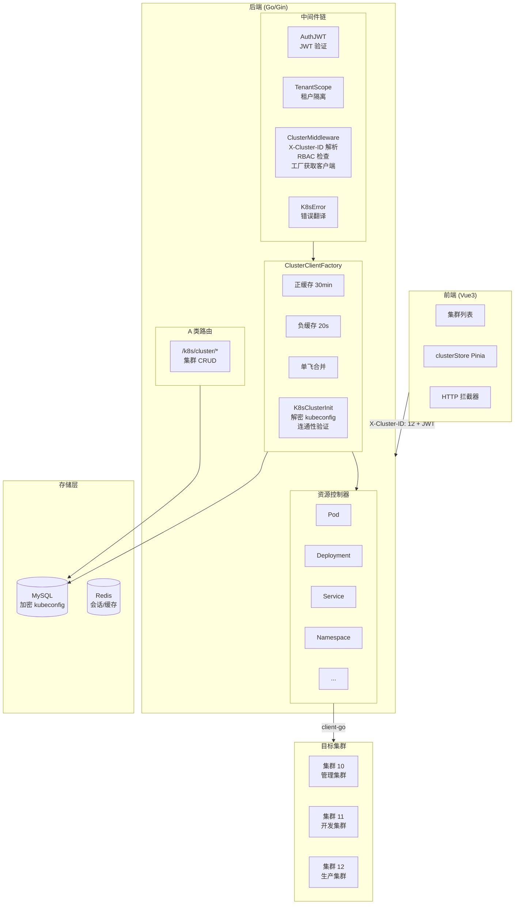
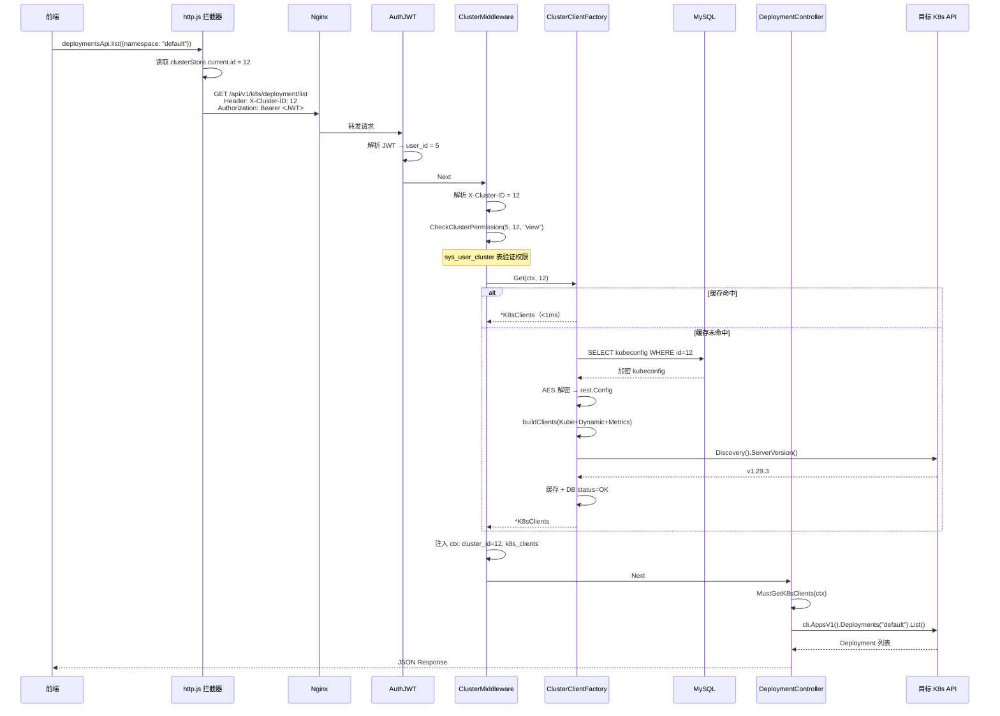

# 多集群管理架构设计文档

> 版本: v1.0 | 更新时间: 2026-07-31

## 一、概述

平台采用 **Hub 模式** 多集群架构（类似 Rancher/KubeSphere），一个控制平面管理多个 K8s 集群。核心思路：

- **DB 存连接串**：每个目标集群的 kubeconfig AES-256-GCM 加密存储在平台数据库
- **工厂按需初始化**：`ClusterClientFactory` 懒加载 + 缓存 + 单飞 + 负缓存 + 故障隔离
- **中间件透明注入**：前端传 `X-Cluster-ID` Header，中间件解析后注入 `*K8sClients` 到上下文
- **client-go 直连目标**：资源控制器用注入的客户端直接操作目标集群 API Server

## 二、系统架构图



## 三、核心请求链路

以用户查看 Deployment 列表为例：



## 四、路由分级

所有 API 按是否需要集群上下文分为三级：

| 级别 | 前缀 | 需要 X-Cluster-ID | 示例 | 说明 |
|------|------|-------------------|------|------|
| **A 类** | `/api/v1/k8s/cluster/` | 否 | `cluster/create`, `cluster/list` | 集群自身 CRUD，平台级 |
| **B 类** | `/api/v1/k8s/{resource}/` | **是** | `pod/list`, `deployment/update` | 操作目标集群资源 |
| **C 类** | `/api/v1/k8s/cicd/` | 否 | `pipeline/run`, `stage/deploy` | CI/CD 流水线，平台级 |

前端 `http.js` 根据 URL 前缀自动判断是否注入 `X-Cluster-ID` Header：

```javascript
// http.js 请求拦截器
const needsClusterID = (url) => {
  const skipPrefixes = [
    '/auth/',        // 登录
    '/k8s/cluster/', // 集群 CRUD
    '/k8s/cicd/',    // CI/CD
    '/rbac/',        // 权限管理
    '/user/',        // 用户管理
    '/platform/',    // 平台功能
    '/monitoring/',  // 监控
  ]
  return !skipPrefixes.some(p => url.includes(p))
}

if (needsClusterID(config.url)) {
  config.headers['X-Cluster-ID'] = clusterStore.current?.id
}
```

## 五、集群客户端工厂

`ClusterClientFactory` 是整个多集群架构的核心，负责集群客户端的生命周期管理。

### 5.1 结构定义

```go
// K8sClients 客户端套餐
type K8sClients struct {
    Config       *rest.Config              // 连接配置
    Kube         *kubernetes.Clientset     // 核心 API（Deploy/Service/Pod...）
    Dynamic      dynamic.Interface         // 动态客户端（CRD）
    Metrics      *metricsclient.Clientset  // 指标 API（HPA/资源监控）
    SupportsEvV1 bool                      // events.k8s.io/v1 能力
}
```

```go
// ClusterClientFactory 工厂
type ClusterClientFactory struct {
    m        map[uint32]*cachedClients  // 正缓存
    failures map[uint32]failureRecord   // 负缓存（失败集群快速拒绝）
    g        singleflight.Group         // 并发合并
    baseTTL  time.Duration              // 30 分钟
    jitter   time.Duration              // 3 分钟随机抖动
}
```

### 5.2 Get() 流程

```
factory.Get(ctx, clusterID)
  │
  ├── 1. 读 DB → ver = ModifiedAt（版本号用于缓存失效）
  │
  ├── 2. 正缓存命中（版本相同 + 未过期）→ 直接返回
  │
  ├── 3. 负缓存命中（版本相同 + 20s 内失败过）→ 快速返回 503
  │
  └── 4. 缓存未命中 → singleflight.Do("12:1700000000")
       │
       ├── 重新读 DB（最终一致性来源）
       ├── K8sClusterInit()
       │   ├── DAO 解密 kubeconfig → rest.Config
       │   ├── buildClients(Kube + Dynamic + Metrics)
       │   └── Discovery().ServerVersion() 连通性验证
       │
       ├── 成功 → 缓存 30min ± jitter + DB status=OK
       └── 失败 → 驱逐缓存 + 标记负缓存 20s
```

### 5.3 关键调优参数

| 参数 | 默认值 | 说明 |
|------|--------|------|
| 连接超时 | 30s | rest.Config.Timeout |
| QPS | 50 | client-go 限流 |
| Burst | 100 | client-go 突发 |
| 缓存 TTL | 30 分钟 | 加 0~3 分钟随机抖动防雪崩 |
| 负缓存 TTL | 20 秒 | 失败集群快速拒绝，避免阻塞 |
| Insecure | true | 支持自签证书集群 |

### 5.4 故障隔离

一个集群挂了**不影响**其他集群：

```
集群 10 → ✅ 正常，缓存返回 <1ms
集群 11 → ❌ 不可达，负缓存 20s 内 503，不阻塞
集群 12 → ✅ 正常
```

## 六、多集群 RBAC

### 6.1 数据模型

`sys_user_cluster` 表控制用户对集群的细粒度权限：

```sql
CREATE TABLE sys_user_cluster (
    user_id    INT,     -- 用户 ID
    cluster_id INT,     -- 集群 ID
    role_id    INT,     -- 角色 ID（cluster_admin / operator / viewer）
    PRIMARY KEY (user_id, cluster_id)
);
```

### 6.2 检查流程

```
请求 → ClusterMiddleware
  │
  ├── super_admin → 全部放行
  │
  └── 普通用户
      ├── 查 sys_user_cluster 表
      ├── 匹配角色（cluster_admin / operator / viewer）
      ├── 对比 action（view / create / update / delete / exec）
      ├── 匹配 → 放行
      └── 不匹配 → 403
```

### 6.3 角色权限矩阵

| 操作 | cluster_admin | operator | viewer |
|------|:---:|:---:|:---:|
| 查看资源（List/Get） | ✅ | ✅ | ✅ |
| 创建资源（Create） | ✅ | ✅ | - |
| 更新资源（Update/Scale） | ✅ | ✅ | - |
| 删除资源（Delete） | ✅ | - | - |
| 终端登录（Exec） | ✅ | ✅ | - |
| 驱逐节点（Drain） | ✅ | - | - |

## 七、Kubeconfig 安全

### 7.1 加密存储

```
写入：明文 kubeconfig → AES-256-GCM（密钥来自 config.yaml Security.KubeConfigEncryptKey）
     → "ENC:" + base64(ciphertext) → 存入 DB

读取：DB → 检测 "ENC:" 前缀
     → AES 解密 → 明文 rest.Config → client-go

返回前端：json:"-" 标签，永不序列化
```

### 7.2 兼容策略

`DecodeKubeconfigSmart()` 同时支持三种格式：
- `ENC:base64(...)` → AES 解密
- 明文 YAML/JSON → 直接解析
- 旧版 base64 → 解码后解析

## 八、前端集群上下文

### 8.1 Pinia Store

```javascript
// stores/cluster.js
export const useClusterStore = defineStore('cluster', {
  state: () => ({ current: null }),
  setCurrent(cluster) {
    this.current = { ...cluster, id: Number(cluster.id) }
    localStorage.setItem('currentCluster', JSON.stringify(this.current))
  },
  hydrate() {
    const raw = localStorage.getItem('currentCluster')
    if (raw) this.current = JSON.parse(raw)
  }
})
```

### 8.2 路由结构

```
/clusters              → 集群列表页（A 类，无 X-Cluster-ID）
/c/:clusterId/nodes    → 节点管理（B 类，自动注入 X-Cluster-ID）
/c/:clusterId/workloads → 工作负载
/c/:clusterId/network  → 网络
/c/:clusterId/storage  → 存储
```

- 路径解析兜底：拦截器从 URL `/c/:id/` 也能提取 clusterId，不依赖 store
- 路由守卫：`beforeEach` 检查 `canAccessCluster(clusterId, 'view')`
- 刷新保持：`localStorage` → `hydrate()` → store 恢复

## 九、非 HTTP 场景的工厂使用

除了 HTTP 中间件注入，以下场景也通过工厂获取集群客户端：

| 场景 | 文件 | 调用方式 |
|------|------|---------|
| 平台健康检查 | `services/platform_health.go` | 定时协程遍历所有集群，`factory.Get()` 后探活 |
| CICD 自动部署 | `services/cicd_executor.go` | 后台任务根据 `pipeline.target_cluster_id` 获取客户端 |
| 应用商店安装 | `services/app_store.go` | 一键部署到指定集群 |
| 快速接入向导 | `services/quick_onboard.go` | 导入已有 K8s 资源 |

## 十、错误映射

| 场景 | HTTP 码 | 错误码 | 前端提示 |
|------|---------|--------|---------|
| 缺少 X-Cluster-ID | 400 | 40001 | 缺少集群 ID |
| ID 格式错误 | 400 | 40002 | 无效的集群 ID |
| 集群不存在 | 404 | 40401 | 集群不存在或已删除 |
| 无集群权限 | 403 | - | 无该集群操作权限 |
| 集群不可达 | 503 | - | 集群暂时不可用（不泄露 apiserver 地址） |
| K8s 404 | 404 | - | 资源不存在（中文翻译） |
| K8s 409 | 409 | - | 资源冲突（中文翻译） |
| K8s 503 | 503 | - | 集群服务暂时不可用 |

## 十一、关键文件索引

| 模块 | 文件路径 |
|------|---------|
| 集群模型 + 加密 | `internal/app/models/k8s_cluster.go` |
| 加密工具 | `pkg/utils/crypto.go`, `pkg/utils/kubeconfig.go` |
| 集群控制器 | `internal/app/controllers/api/v1/k8s_cluster/k8s_cluster.go` |
| 集群路由 | `internal/app/routers/kube_cluster/k8s.go` |
| 集群服务 + 客户端构建 | `internal/app/services/k8s_cluster.go` |
| 客户端工厂 | `internal/app/services/k8s_cluster_factory.go` |
| 客户端类型定义 | `internal/app/services/types.go` |
| 集群 DAO | `internal/app/dao/k8s_cluster.go` |
| ClusterMiddleware | `middlewares/cluster.go` |
| 上下文注入/获取 | `middlewares/helper.go` |
| K8s 错误翻译 | `middlewares/k8serror.go` |
| 路由注册（A/B/C 级） | `initialize/router.go` |
| RBAC 服务 + DAO | `internal/app/services/rbac.go`, `internal/app/dao/rbac.go` |
| 平台健康检查 | `internal/app/services/platform_health.go` |
| 前端集群 Store | `k8s-web/src/stores/cluster.js` |
| 前端 HTTP 拦截器 | `k8s-web/src/api/http.js` |
| 前端路由 | `k8s-web/src/router/index.js` |
| 集群选择器组件 | `k8s-web/src/components/cluster/ClusterSelector.vue` |
| 集群布局 | `k8s-web/src/layouts/ClusterLayout.vue` |
