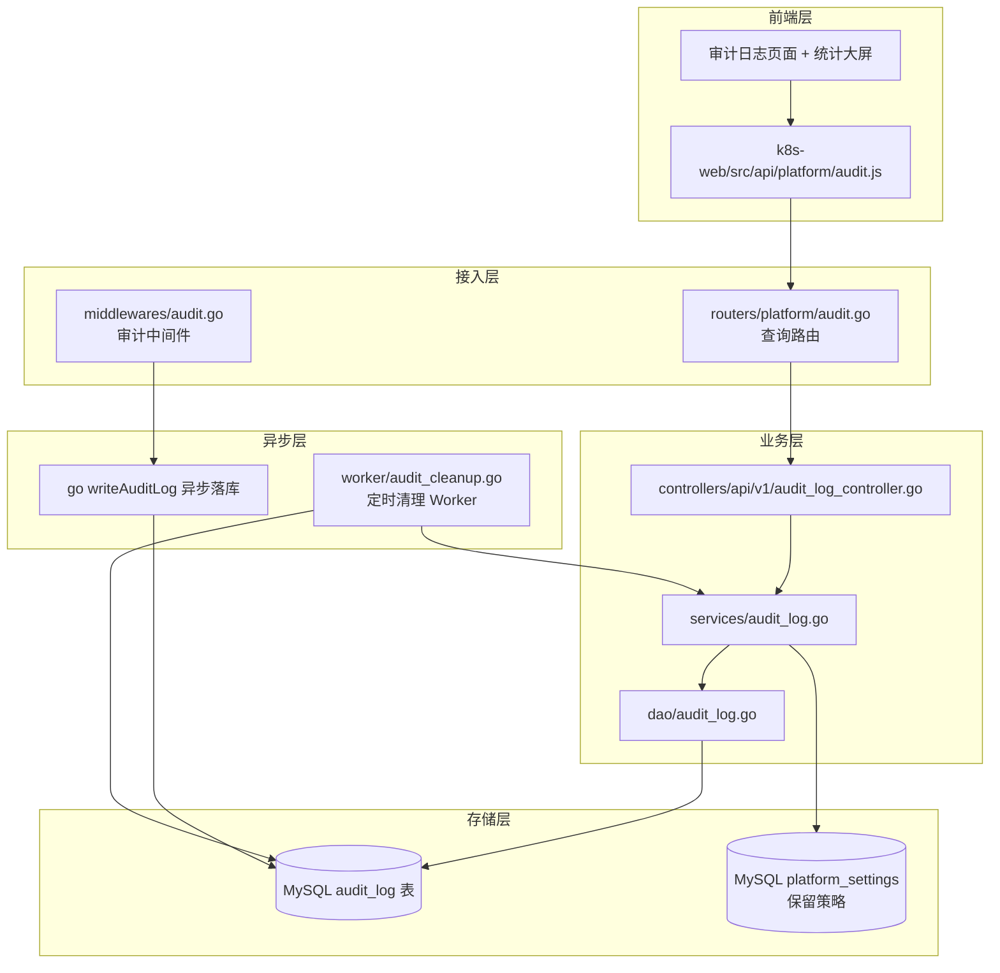
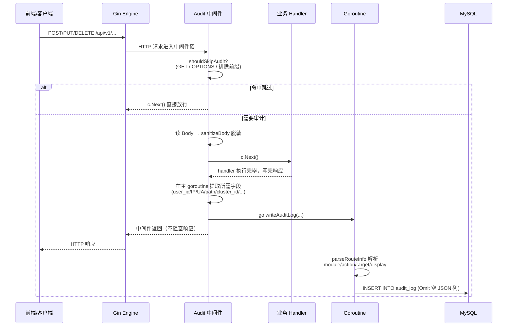
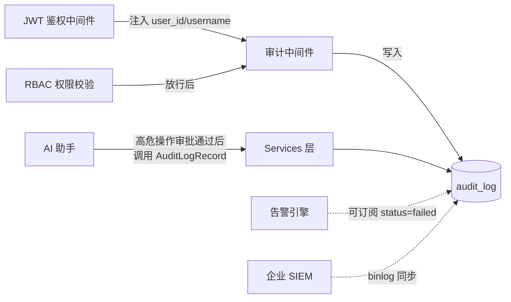

# 企业级审计日志系统架构设计文档

> 适用项目：**K8sOperation 多集群运维平台**
> 文档版本：v1.0
> 最近更新：2026-05-22
> 维护者：平台架构组

---

## 1. 文档概述

本文档描述 K8sOperation 平台**企业级审计日志（Audit Log）系统**的整体架构、数据模型、核心组件、关键设计决策及扩展方法。
受众包括：平台研发、SRE、安全合规、二次开发团队。

阅读本文你将能够：
- 在不读源码的情况下回答「平台到底审计了什么、不审计什么、为什么」
- 在新增业务模块时按规范产出可被追溯的审计记录
- 在出现"日志没有落库""字段被截断"等问题时快速定位根因
- 评估当前实现是否满足你所在企业的等保/SOC2/ISO27001 合规要求

---

## 2. 设计目标与合规背景

### 2.1 业务目标

| 目标 | 说明 |
|---|---|
| **可追溯** | 谁、在什么时间、用什么 IP、对哪个资源、做了什么操作、结果如何，全部可查 |
| **不可绕过** | 由全局中间件强制采集，不依赖业务代码主动埋点 |
| **零侵入业务** | 业务 Controller 不需要写一行审计代码，写操作天然落库 |
| **不阻塞主链路** | 审计落库异步执行，即使数据库慢也不影响 API 响应 |
| **敏感数据安全** | 密码、Token、Kubeconfig 等敏感字段自动脱敏 |
| **可治理** | 提供保留策略（按天/永久）、定时清理、手动清理、导出能力 |
| **可观测** | 提供统计 API（Top 用户、Top 模块、24h 时序）支撑审计大屏 |

### 2.2 合规对齐

| 合规项 | 落地方式 |
|---|---|
| 等保 2.0 三级 § 8.1.4.3 安全审计 | `audit_log` 表 + 默认 30 天保留 + 永久保留可选 |
| ISO 27001 A.12.4.1 事件记录 | 全量 POST/PUT/DELETE + 登录/登出审计 |
| ISO 27001 A.12.4.3 管理员日志 | 通过 `username`、`module=rbac` 等字段过滤管理员行为 |
| SOC 2 CC7.2 异常检测 | 暴露 `status=failed` + `response_code>=400` 字段供 SIEM 接入 |

---

## 3. 总体架构

### 3.1 分层架构图



### 3.2 模块清单

| 层 | 文件 | 职责 |
|---|---|---|
| 中间件 | `middlewares/audit.go` | HTTP 拦截、脱敏、异步写入 |
| 模型 | `internal/app/models/audit_log.go` | `AuditLog` 表结构、查询/响应 DTO、模块/操作常量 |
| DAO | `internal/app/dao/audit_log.go` | 增删查改、统计、清理、保留策略 |
| Service | `internal/app/services/audit_log.go` | 业务编排（保留策略 → 清理） |
| Controller | `internal/app/controllers/api/v1/audit_log_controller.go` | REST 端点 |
| 路由 | `internal/app/routers/platform/audit.go` | 7 个 REST 接口注册 |
| Worker | `internal/app/worker/audit_cleanup.go` | 每日 24h 自动清理 |
| 全局注册 | `initialize/server.go:80` | `s.Use(middlewares.Audit(nil))` 全局挂载 |
| 前端 API | `k8s-web/src/api/platform/audit.js` | Axios 客户端封装 |

---

## 4. 数据流

### 4.1 写入流（核心）



**关键性质：**

1. **异步**：`go writeAuditLog(...)`，对响应延迟无影响。
2. **跨协程安全**：所有依赖 `*gin.Context` 的字段（user_id、headers、IP）**都在主 goroutine 提取为值类型**后传入新 goroutine。
   > ⚠️ Gin 通过 `sync.Pool` 复用 `Context`，handler 一返回就可能被回收，goroutine 内访问会读到脏数据。
3. **JSON 空值规避**：`AuditLog.Create` 在 `Detail`/`Extra` 为空字符串时使用 `db.Omit("Detail","Extra")`，避免 MySQL JSON 列报 `Invalid JSON text`。
4. **panic 兜底**：goroutine 内 `defer recover()`，单条记录失败不影响后续请求。

### 4.2 查询流

```
浏览器 → Vite Proxy
       → GET /api/v1/platform/audit/logs?page=1&page_size=20&...
       → JWT 中间件 校验 Authorization Bearer
       → AuditLogController.List
       → Services.AuditLogList
       → Dao.AuditLogList (动态 WHERE + 排序白名单 + 分页)
       → MySQL audit_log
       → 返回 {list, total, page, page_size}
```

### 4.3 清理流

```
启动后 5 分钟 → 首次清理（防止冷启动写入风暴）
之后每 24h     → ticker 触发
                → 读 platform_settings.security.audit_retention
                → IsPermanent? 跳过
                → DELETE FROM audit_log WHERE created_at < (now - retention_days)
                → 写日志：deleted_count
```

---

## 5. 核心组件详解

### 5.1 审计中间件 `middlewares/audit.go`

#### 5.1.1 配置结构

```go
type AuditConfig struct {
    RecordGET     bool     // 是否记录 GET（默认 false，避免审计灌水）
    ExcludePaths  []string // 排除路径前缀
    MaxBodySize   int      // Body 最大记录字节数（默认 4096）
}
```

**默认配置 `DefaultAuditConfig()`：**
- `RecordGET = false`
- `ExcludePaths = ["/api/v1/platform/health", "/api/v1/monitoring/", "/swagger/", "/api/v1/ai/chat"]`
- `MaxBodySize = 4096`

#### 5.1.2 跳过逻辑 `shouldSkipAudit`

```go
1. method == GET && !RecordGET    → skip
2. method == OPTIONS              → skip（CORS 预检）
3. path 命中 ExcludePaths 前缀    → skip
4. otherwise                      → audit
```

#### 5.1.3 路由信息解析 `parseRouteInfo`

通过 `strings.Contains(path, "/k8s/deployment")` 等模式匹配，将路径映射为：
- `module`：业务大类（auth / workload / network / config / storage / cicd / rbac / platform / ai / image / monitoring）
- `target_type`：被操作资源（deployment / pod / pipeline / role / user / ...）
- `action_display`：可读显示（如 `"create Deployment"`、`"用户登录"`）

| URL 模式 | module | target_type | display |
|---|---|---|---|
| `/auth/login` | auth | session | 用户登录 |
| `/auth/logout` | auth | session | 用户登出 |
| `/k8s/deployment` | workload | deployment | `${action} Deployment` |
| `/k8s/pod` | workload | pod | `${action} Pod` |
| `/k8s/service` | network | service | `${action} Service` |
| `/k8s/ingress` | network | ingress | `${action} Ingress` |
| `/k8s/configmap` | config | configmap | `${action} ConfigMap` |
| `/k8s/secret` | config | secret | `${action} Secret` |
| `/k8s/pv` `/pvc` `/storageclass` | storage | * | * |
| `/k8s/node` `/namespace` `/cluster` | cluster | * | * |
| `/k8s/cicd` | cicd | pipeline | `${action} 流水线` |
| `/rbac` | rbac | role | `${action} 权限` |
| `/user` | rbac | user | `${action} 用户` |
| `/platform/settings` | platform | settings | 更新平台设置 |
| `/platform/appstore` | platform | appstore | `${action} 应用商城` |
| `/ai/` | ai | assistant | AI助手操作 |
| `/image/` | image | registry | `${action} 镜像` |
| `/monitoring/` | monitoring | alert | `${action} 监控` |

#### 5.1.4 敏感字段脱敏 `sanitizeBody`

仅对 `Content-Type: application/json` 生效，自动将以下字段值替换为 `"***"`：

```
password, secret, token, kube_config, kubeconfig,
access_key_secret, access_key_id, webhook
```

非 JSON 请求（包括 `multipart/form-data`）不解析脱敏，但 multipart 直接记录占位串 `"[multipart/form-data upload]"`，不会把上传文件二进制写库。

#### 5.1.5 状态判定

```
HTTP responseCode >= 400  → status = "failed", error_message = "HTTP {code}"
HTTP responseCode <  400  → status = "success"
```

---

### 5.2 数据模型 `models/audit_log.go`

#### 5.2.1 `AuditLog` 完整字段

| 字段 | 类型 | GORM 标签 | 说明 |
|---|---|---|---|
| ID | int64 | primaryKey;autoIncrement | 主键 |
| UserID | int64 | not null;index:idx_audit_user | 用户主键（未登录=0） |
| Username | string(191) | not null | 用户名快照 |
| UserIP | string(50) |  | 客户端 IP（取自 `c.ClientIP()`） |
| UserAgent | string(500) |  | UA |
| **Action** | string(100) | not null;index:idx_audit_action | `create/update/delete/login/logout/exec/approve/reject/deploy/scale/view` |
| ActionDisplay | string(191) |  | 中文显示名 |
| **Module** | string(100) | not null;index:idx_audit_module | `auth/cluster/workload/network/config/storage/cicd/rbac/platform/ai/monitoring/image` |
| TargetType | string(100) | index:idx_audit_target | 资源类型 |
| TargetID | string(100) | index:idx_audit_target | 资源 ID |
| TargetName | string(191) |  | 资源名 |
| RequestURI | string(500) |  | 请求路径 |
| RequestMethod | string(10) |  | HTTP 方法 |
| RequestBody | text |  | 脱敏后的请求体（最长 4096 字节） |
| ResponseCode | int |  | HTTP 状态码 |
| ResponseMessage | string(500) |  | 业务响应消息 |
| **Detail** | json | type:json | 操作详情 JSON（业务层手工写入） |
| **Extra** | json | type:json | 扩展字段 JSON |
| ClusterID | *int64 | index:idx_audit_cluster | 集群 ID（可空） |
| ClusterName | string(191) |  | 集群名快照 |
| Namespace | string(100) |  | 命名空间 |
| PipelineID | *int64 | index:idx_audit_pipeline | 流水线 ID |
| PipelineName | string(191) |  | 流水线名 |
| ProjectID | *int64 |  | 项目 ID |
| ProjectName | string(191) |  | 项目名 |
| **Status** | string(50) | not null;default:'success';index:idx_audit_status | success / failed |
| ErrorMessage | string(1000) |  | 错误描述 |
| DurationMs | int |  | 处理耗时（毫秒） |
| **CreatedAt** | int64 | not null;index:idx_audit_created | Unix 秒级时间戳 |

> 表名固定 `audit_log`（单数），由 `(*AuditLog).TableName()` 锁定，避免 GORM 默认复数化。

#### 5.2.2 索引设计

7 个二级索引覆盖最常用的查询场景：

| 索引 | 列 | 服务的查询场景 |
|---|---|---|
| idx_audit_user | user_id | 「某人都做了什么」 |
| idx_audit_action | action | 「所有删除操作」 |
| idx_audit_module | module | 「CICD 模块的所有操作」 |
| idx_audit_target | (target_type, target_id) | 「某个具体资源的全部历史」 |
| idx_audit_cluster | cluster_id | 「某集群下所有动作」 |
| idx_audit_pipeline | pipeline_id | 「某流水线的发布审计」 |
| idx_audit_status | status | 「失败操作」 |
| idx_audit_created | created_at | 时间范围 + 默认排序 |

#### 5.2.3 关键方法

```go
// JSON 列空字符串安全处理
func (a *AuditLog) Create(db *gorm.DB) error {
    var omits []string
    if a.Detail == "" { omits = append(omits, "Detail") }
    if a.Extra  == "" { omits = append(omits, "Extra") }
    if len(omits) > 0 {
        return db.Omit(omits...).Create(a).Error
    }
    return db.Create(a).Error
}
```

---

### 5.3 DAO 层 `dao/audit_log.go`

提供 8 个能力：

| 方法 | 用途 |
|---|---|
| `AuditLogCreate` | 单条写入（自动补 `created_at`） |
| `AuditLogBatchCreate` | 批量写入（每批 100） |
| `AuditLogList` | **动态 WHERE + 排序白名单 + 分页** |
| `AuditLogGetByID` | 详情 |
| `AuditLogGetStatistics` | 今日/本周/总量 + 成功率 + Top5 用户 + Top5 模块 + 操作汇总 + 24h 时序 |
| `AuditLogCleanup` | 按天清理过期数据 |
| `AuditLogGetRetentionPolicy` | 从 `platform_settings.security.audit_retention` 读取保留策略 |
| `AuditLogUpdateRetentionPolicy` | 写回 `platform_settings`（DB 化配置） |
| `AuditLogExport` | 同 List 但无分页，封顶 10000 条 |

#### 5.3.1 安全细节

```go
// 排序字段白名单防 SQL 注入
allowedFields := map[string]bool{
    "created_at": true, "duration_ms": true, "user_id": true,
    "action": true, "module": true, "status": true,
}
if !allowedFields[query.SortField] { /* 回退 created_at */ }

// 分页上限保护
if pageSize > 100 { pageSize = 100 }

// 导出上限保护
db.Limit(10000)
```

#### 5.3.2 关键词搜索

```sql
WHERE (target_name LIKE %kw%
   OR action_display LIKE %kw%
   OR request_uri LIKE %kw%
   OR error_message LIKE %kw%)
```

> ⚠️ 4 个字段同时 LIKE 在大表上不走索引，是预期的"管理员后台 OLTP-light 查询"。如果记录量超过百万级建议接 Elasticsearch（见 §10 改进路线）。

---

### 5.4 Service 层 `services/audit_log.go`

薄层封装，唯一有业务编排的是 `AuditLogCleanup`：

```go
func (s *Services) AuditLogCleanup(ctx context.Context) (int64, error) {
    policy, err := s.dao.AuditLogGetRetentionPolicy(ctx)
    if err != nil { return 0, err }
    if policy.IsPermanent || policy.RetentionDays == 0 { return 0, nil }
    return s.dao.AuditLogCleanup(ctx, policy.RetentionDays)
}
```

**永久保留语义统一在 Service 层判断**，DAO 只关心"按天数清理"。

---

### 5.5 Controller 层 `controllers/api/v1/audit_log_controller.go`

7 个 endpoint：

| Method | Path | 控制器方法 | 说明 |
|---|---|---|---|
| GET | `/api/v1/platform/audit/logs` | List | 分页查询 |
| GET | `/api/v1/platform/audit/logs/:id` | Detail | 详情 |
| GET | `/api/v1/platform/audit/statistics` | Statistics | 统计大屏 |
| GET | `/api/v1/platform/audit/retention` | GetRetention | 读保留策略 |
| PUT | `/api/v1/platform/audit/retention` | UpdateRetention | 改保留策略 |
| POST | `/api/v1/platform/audit/cleanup` | Cleanup | 手工清理 |
| GET | `/api/v1/platform/audit/export` | Export | 导出 |

> 所有接口由 JWT 中间件 + RBAC 权限校验保护，需具备「平台管理 → 审计日志」权限位。

---

### 5.6 路由 `routers/platform/audit.go`

```go
func (r *AuditLogRouter) Inject(router *gin.RouterGroup) {
    ctrl := v1.NewAuditLogController()
    g := router.Group("/platform/audit")
    {
        g.GET("/logs",       ctrl.List)
        g.GET("/logs/:id",   ctrl.Detail)
        g.GET("/statistics", ctrl.Statistics)
        g.GET("/retention",  ctrl.GetRetention)
        g.PUT("/retention",  ctrl.UpdateRetention)
        g.POST("/cleanup",   ctrl.Cleanup)
        g.GET("/export",     ctrl.Export)
    }
}
```

---

### 5.7 定时清理 Worker `worker/audit_cleanup.go`

| 阶段 | 时间 | 行为 |
|---|---|---|
| 启动 | T+5min | 首次清理（避开冷启动） |
| 周期 | 每 24h | 调用 `Services.AuditLogCleanup` |
| 终止 | `Stop()` | `close(stopCh)` |
| 容错 | 60s 超时 + error 日志 | 失败不影响下一轮 |
| 静默 | `affected==0` 时 Debug 级 | 避免日志噪音 |

启动入口在 `internal/bootstrap/bootstrap.go:94`：

```
[AuditCleanup] 审计日志定时清理 Worker 已启动
```

---

### 5.8 前端 API `k8s-web/src/api/platform/audit.js`

7 个对应函数 1:1 包装：

```js
getAuditLogs(params)           // GET /logs
getAuditLogDetail(id)          // GET /logs/:id
getAuditStatistics()           // GET /statistics
getAuditRetention()            // GET /retention
updateAuditRetention(data)     // PUT /retention
cleanupAuditLogs()             // POST /cleanup
exportAuditLogs(params)        // GET /export
```

所有请求经 `@/api/http` 全局拦截器自动附带 `Authorization: Bearer <token>`。

---

## 6. REST API 接口清单

### 6.1 列表 `GET /api/v1/platform/audit/logs`

请求参数：

| 参数 | 类型 | 说明 |
|---|---|---|
| page | int | 页码，默认 1 |
| page_size | int | 默认 20，上限 100 |
| user_id | int64 | 精确匹配 |
| username | string | 模糊匹配 |
| action | string | 精确 |
| module | string | 精确 |
| target_type | string | 精确 |
| status | string | success/failed |
| cluster_id | int64 | 精确 |
| keyword | string | 4 字段 LIKE |
| start_time / end_time | int64 | Unix 秒 |
| sort_field | string | 白名单内字段 |
| sort_order | string | asc/desc |

响应：

```json
{
  "code": 0, "msg": "OK",
  "data": {
    "list": [ AuditLog... ],
    "total": 123,
    "page": 1,
    "page_size": 20
  }
}
```

### 6.2 统计 `GET /api/v1/platform/audit/statistics`

```json
{
  "total_today":  100,
  "total_week":   500,
  "total_all":   9999,
  "success_rate": 98.7,
  "top_users":    [ { "username": "admin", "count": 50 } ],
  "top_modules":  [ { "module":   "workload", "count": 80 } ],
  "action_summary":[ { "action":  "create",   "count": 30 } ],
  "hourly_counts": [ { "hour": 0, "count": 1 }, ..., { "hour": 23, "count": 8 } ]
}
```

### 6.3 保留策略 `GET / PUT /retention`

```json
// GET 响应
{ "retention_days": 30, "is_permanent": false }

// PUT 请求
{ "retention_days": 90, "is_permanent": false }
// 或
{ "retention_days": 0,  "is_permanent": true }   // 永久
```

### 6.4 清理 `POST /cleanup`

```json
{ "message": "清理完成", "affected": 1234 }
```

### 6.5 导出 `GET /export`

筛选参数与 List 相同，返回最多 10000 条。

---

## 7. 关键设计决策（ADR）

### ADR-1：默认不审计 GET

**决策**：`RecordGET = false`，且排除 `/health`、`/monitoring/`、`/swagger/`、`/ai/chat`。

**理由**：
1. GET 不改变系统状态，对合规审计价值低。
2. 一个用户在监控页停留 3 分钟产生 ~60 次轮询，全审计将快速灌满表。
3. `/ai/chat` 包含用户输入，体量大且可能涉及隐私，需要单独走 AI 审计通道。

**反向方案**：若组织合规要求"所有访问都要审计"，将 `DefaultAuditConfig.RecordGET` 改为 `true`，并扩容 audit_log 表（建议接归档冷库）。

### ADR-2：异步落库 + 主协程取数

**决策**：handler 返回后启用 `go writeAuditLog(...)`，但所有 `*gin.Context` 字段必须在主协程提取为值类型。

**理由**：
- 同步落库会让所有写操作 +5~50ms 延迟，无法接受。
- Gin `Context` 池化，跨 goroutine 访问会读到下一次请求的脏数据 → 历史 P0 事故根因。

**惩罚**：审计落库失败时 API 已经返回成功 → 必须用 `recover()` + ERROR 级日志兜底，并接监控告警。

### ADR-3：JSON 列空值用 `db.Omit` 而非 `default:'{}'`

**决策**：`Detail`/`Extra` 为空字符串时，调用 `db.Omit("Detail","Extra")` 跳过这两列。

**理由**：MySQL JSON 列不接受空字符串 `""`，仅接受合法 JSON。直接 INSERT 会报：
```
Invalid JSON text: "The document is empty." at position 0
```
设默认值 `'{}'` 也可以，但会让"未填写"和"显式空对象"语义不可分。

### ADR-4：保留策略 DB 化（platform_settings 表）

**决策**：保留天数读写 `platform_settings.security.audit_retention`，**不放 config.yaml**。

**理由**：与项目"运行期配置走 DB、config.yaml 仅做首次启动引导"的整体规约一致；管理员可通过前端 PUT 接口热更新。

### ADR-5：路由信息从 URL 推导，而不是要求业务方注册

**决策**：`parseRouteInfo` 通过 `strings.Contains(path, "...")` 静态映射 module/target_type/action_display。

**理由**：
- 业务侧零侵入。
- 新路由命名只要遵循 `/api/v1/k8s/<resource>` 规约即可被自动识别。
- 缺点：无法精确反映业务语义（如"批量导入"会被记成 `create`）→ 由 ADR-6 中的"业务层手工记录"补齐。

### ADR-6：业务层可通过 `AuditLogRecord` 主动补充

`Services.AuditLogRecord(ctx, log)` 暴露给业务层，用于：
- 中间件无法识别的复合操作（如「批准发布并自动部署」）
- 需要写入 `Detail`/`Extra` JSON 详情
- 中间件被跳过但业务认为应当审计的 GET（如「下载敏感文件」）

### ADR-7：脱敏在中间件层而不是 DAO 层

**决策**：进数据库前已脱敏，DB 落地的就是 `password=***`。

**理由**：
- 防止 DBA、备份、慢查询日志看到明文。
- 即使后续运维误开 SELECT 权限，敏感字段仍受保护。

---

## 8. 中间件配置项

```go
// 默认开启全局审计
s.Use(middlewares.Audit(nil))

// 自定义配置（如生产开启 GET 审计）
s.Use(middlewares.Audit(&middlewares.AuditConfig{
    RecordGET:    true,
    ExcludePaths: []string{"/api/v1/platform/health", "/swagger/"},
    MaxBodySize:  8192,
}))
```

| 字段 | 默认 | 调优建议 |
|---|---|---|
| RecordGET | false | 合规高的环境改 `true`，但需扩容表 |
| ExcludePaths | 4 项 | 新增高频读接口时追加前缀 |
| MaxBodySize | 4096 | 上传/批量场景可调到 8192~16384，过大会让 audit_log 体积失控 |

---

## 9. 扩展指南

### 9.1 新增业务模块审计

只需在 `parseRouteInfo` 增加 `case`：

```go
case strings.Contains(path, "/k8s/hpa"):
    module, targetType = "workload", "hpa"
    actionDisplay = action + " HPA"
```

### 9.2 业务层手工写入详细审计

```go
import "k8soperation/internal/app/services"

svc := services.NewServices()
_ = svc.AuditLogRecord(ctx, &models.AuditLog{
    UserID:        userID,
    Username:      username,
    Module:        models.AuditModuleCICD,
    Action:        models.AuditActionApprove,
    ActionDisplay: "审批高危发布",
    TargetType:    "release",
    TargetID:      strconv.FormatInt(releaseID, 10),
    TargetName:    releaseName,
    Detail:        toolJSON,         // 工具调用 JSON
    Extra:         approveJSON,      // 审批人/时间/原因 JSON
    Status:        models.AuditStatusSuccess,
})
```

### 9.3 新增敏感字段脱敏

修改 `sanitizeBody`：

```go
sensitiveKeys := []string{
    "password", "secret", "token",
    "kube_config", "kubeconfig",
    "access_key_secret", "access_key_id",
    "webhook",
    "private_key",   // ← 新增
    "smtp_password", // ← 新增
}
```

### 9.4 接入 SIEM / 集中式日志

推荐方式（不污染主链路）：

1. 在 MySQL 的 audit_log 表上配置 Maxwell/Canal 把 binlog 推到 Kafka。
2. SIEM 消费 Kafka topic，全量写入 ES + 长期对象存储。
3. 平台只保留 30 天热数据用于 UI 查询。

---

## 10. 运维与排错手册

### 10.1 表/字段确认

```bash
# 确认表存在
mysql -uroot -h<host> -P3306 k8s-platform -e "SHOW TABLES LIKE 'audit_log';"

# 确认字段（重点关注 request_uri 不是 request_path）
mysql ... -e "SHOW COLUMNS FROM audit_log;"

# 时间转换查询（created_at 是 bigint Unix 秒）
mysql ... -e "
  SELECT id, username, action, module, request_uri, status,
         FROM_UNIXTIME(created_at) AS created
  FROM audit_log ORDER BY id DESC LIMIT 20;
"
```

### 10.2 常见问题速查

| 现象 | 根因 | 解决 |
|---|---|---|
| 写操作不落库 | AutoMigrate 未注册 AuditLog | 检查 `initialize/db.go` 是否包含 `&models.AuditLog{}` |
| `Invalid JSON text` 错误 | 直接 INSERT 把 Detail/Extra 写成空字符串 | 必须走 `(*AuditLog).Create` 或 `db.Omit` |
| goroutine 报 nil pointer | 在 goroutine 里用了 `c.Get`/`c.GetHeader` | 严格在主协程提取为值类型，再传给 goroutine |
| 审计表里 `username` 为空 | 接口未走 JWT 中间件，user_id/current_user_name 未注入 | 该接口属于公开接口（如登录失败），属预期 |
| 前端"前端操作没有记录" | 前端只做了浏览（GET），中间件按设计跳过 | 让用户做一次 POST/PUT/DELETE 验证；或开启 RecordGET |
| 审计表暴涨 | RecordGET=true 后未做归档 | 缩短 retention_days；或接 ES 归档 |
| 清理不生效 | retention_days=0 表示永久保留 | PUT /retention 改为非 0 |

### 10.3 性能基线

| 写入路径 | P95 |
|---|---|
| 中间件 hot path（仅判断 + 同步取值） | < 0.5ms |
| `go writeAuditLog`（异步） | 用户无感知 |
| 单条 INSERT（含索引） | 2~5ms |
| 列表查询（带 4 字段 keyword） | 数据量 < 50 万条时 < 50ms |
| 统计 `/statistics` | 6 个 Aggregation，建议每分钟前端缓存 |

---

## 11. 与平台其他子系统的关系



- **JWT 鉴权**：负责 `c.Set("user_id", uid)`、`c.Set("current_user_name", uname)`，审计中间件依赖之。
- **RBAC**：审计页本身受 `platform:audit:read` / `platform:audit:write` 权限控制。
- **AI 高危审批**：人工审批通过/拒绝时主动调用 `AuditLogRecord`，写入完整的 `Detail`（工具调用） + `Extra`（审批意见）。
- **告警引擎**：可针对 `status=failed AND module=auth AND COUNT >= N within 1m` 触发暴力破解告警。

---

## 12. 改进路线

| 优先级 | 项目 | 说明 |
|---|---|---|
| P0 | GET 审计白名单字段 | 在 `AuditConfig` 增加 `IncludeGETPaths []string`，仅审计敏感 GET（如 secret 解密、export 下载），兼顾合规与表体积 |
| P1 | ES 归档 | 30 天以前的数据迁移到 ES，UI 列表 union 查询 |
| P1 | 异步队列化 | 写入改 channel + 单 worker 消费，避免高并发下 goroutine 失控 |
| P2 | 字段级 diff | UPDATE 时记录 before/after JSON 写入 `Detail` |
| P2 | 多租户分表 | 按 `cluster_id`/`tenant_id` 物理分表 |
| P3 | 审计回放 | 通过 `RequestBody + RequestURI + Method` 在隔离环境回放可疑操作 |

---

## 13. 附录

### 13.1 关键文件索引

```
middlewares/audit.go                              # 中间件
internal/app/models/audit_log.go                  # 模型
internal/app/dao/audit_log.go                     # DAO
internal/app/services/audit_log.go                # Service
internal/app/controllers/api/v1/audit_log_controller.go
internal/app/routers/platform/audit.go            # 路由
internal/app/worker/audit_cleanup.go              # Worker
initialize/server.go                              # s.Use(middlewares.Audit(nil))
internal/bootstrap/bootstrap.go                   # AuditCleanupWorker.Start()
k8s-web/src/api/platform/audit.js                 # 前端 API
```

### 13.2 SQL 速查

```sql
-- 最近 24 小时失败操作 Top 10 用户
SELECT username, COUNT(*) AS c
FROM audit_log
WHERE status='failed' AND created_at >= UNIX_TIMESTAMP(NOW()) - 86400
GROUP BY username ORDER BY c DESC LIMIT 10;

-- 某流水线全部审计
SELECT FROM_UNIXTIME(created_at), username, action_display, status
FROM audit_log WHERE pipeline_id = 123 ORDER BY id DESC;

-- 某资源（Deployment foo/ns）的所有动作
SELECT FROM_UNIXTIME(created_at), username, action, status, error_message
FROM audit_log
WHERE target_type='deployment' AND target_name='foo' AND namespace='ns'
ORDER BY id DESC;

-- 一键清理 90 天前
DELETE FROM audit_log WHERE created_at < UNIX_TIMESTAMP(NOW()) - 90*86400;
```

### 13.3 术语表

| 术语 | 含义 |
|---|---|
| 审计日志 | 由审计中间件自动产生的、记录平台所有写操作的不可篡改记录 |
| 保留策略 | 控制审计日志在 DB 中存活时间的规则，0 = 永久 |
| 脱敏 | 把敏感字段值替换为 `***` 后再落库 |
| 异步落库 | 通过 goroutine 把数据库写入移出 HTTP 主链路 |
| 排除路径 | 不参与审计的 URL 前缀集合 |

---

> 文档结束。如需新增字段、新增模块映射或调整保留策略，请同步更新本文档第 5、9 节。
