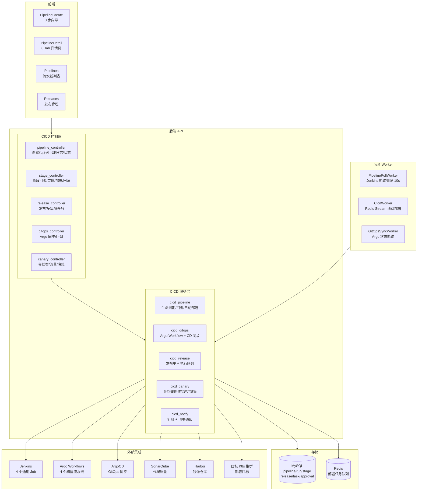

# CICD 发布架构设计文档

> 版本: v1.0 | 更新时间: 2026-07-31

## 一、概述

平台 CICD 系统实现从代码提交到生产部署的**全链路自动化**。核心设计理念：

- **一个模板服务 100 个项目**：4 个通用 Jenkins Job（Go/Java/前端/Python）覆盖所有语言类型
- **一次构建，跨环境晋级**：构建产物（镜像 Digest）不可变，通过审批 + 多集群分发实现 dev → test → staging → prod
- **回调 + 轮询双保险**：Jenkins 回调 + PollWorker 轮询，不丢状态
- **多集群自动部署**：集成多集群管理，构建成功后按 `target_cluster_id` 部署到指定集群

## 二、系统架构图



## 三、全链路时序图

```
用户创建流水线 → 自动触发首次构建 → Jenkins 执行 → 回调平台 → 自动部署 → 通知

┌─────────────┐     ┌──────────┐     ┌─────────┐     ┌──────────┐     ┌──────────┐
│   前端向导    │     │  后端API  │     │ Jenkins │     │  K8s集群  │     │  钉钉通知  │
└──────┬──────┘     └────┬─────┘     └────┬────┘     └────┬─────┘     └────┬─────┘
       │                 │                │               │                │
       │ POST /create    │                │               │                │
       │───────────────→│                │               │                │
       │                 │ 创建 Pipeline   │               │                │
       │                 │──────────────→│               │                │
       │                 │ POST trigger   │               │                │
       │                 │──────────────→│               │                │
       │                 │                │ 拉代码+构建    │                │
       │                 │                │──────┐        │                │
       │                 │                │      │ C++编译│                │
       │                 │                │      │ 测试   │                │
       │                 │                │      │ Sonar  │                │
       │                 │                │      │ Kaniko │                │
       │                 │                │      │ Push   │                │
       │                 │                │←─────┘        │                │
       │                 │                │               │                │
       │                 │ POST /callback │               │                │
       │                 │←──────────────│               │                │
       │                 │ HMAC 签名验证   │               │                │
       │                 │ 更新 Run/Stage  │               │                │
       │                 │                │               │                │
       │                 │ autoDeployToK8s                │                │
       │                 │──────────────────────────────→│                │
       │                 │                │               │ Patch 镜像     │
       │                 │                │               │ 等待 Rollout   │
       │                 │                │               │                │
       │                 │ NotifyBuildResult              │                │
       │                 │─────────────────────────────────────────────────→│
       │                 │                │               │     构建成功！   │
```

## 四、数据库模型

### 4.1 核心表关系

```
cicd_pipeline（流水线定义）
  ├── cicd_pipeline_run（每次执行记录）
  │     └── cicd_pipeline_stage（阶段记录: checkout/compile/test/build/deploy）
  ├── cicd_pipeline_target（多环境部署目标）
  ├── cicd_environment（环境定义）
  │     └── cicd_approval（审批记录）
  └── cicd_release（发布单）
        └── cicd_release_task（多集群任务）
```

### 4.2 cicd_pipeline 表

| 字段分类 | 字段 | 说明 |
|----------|------|------|
| 标识 | `name`, `description` | 名称唯一（软删除范围内） |
| 源码 | `git_repo`, `git_branch` | Git 仓库 + 分支 |
| 模式 | `deploy_mode` | `jenkins` / `gitops` |
| Jenkins | `jenkins_url`, `jenkins_job`, `language_type` | Jenkins 地址 + Job 名 + 语言类型 |
| 部署 | `auto_deploy`, `target_cluster_id`, `target_namespace`, `target_workload_kind/name`, `target_container`, `deploy_env`, `require_approval` | 自动部署配置 |
| 金丝雀 | `enable_canary`, `canary_replicas`, `canary_traffic_ratio`, `canary_duration_sec`, `canary_auto_promote` | 金丝雀发布参数 |
| 质量 | `enable_sonar`, `enable_artifact_upload` | SonarQube / 制品上传 |
| 状态 | `status` (idle/running/disabled), `last_run_status`, `last_build_number` | 运行状态 |

### 4.3 其他关键表

| 表 | 用途 |
|----|------|
| `cicd_pipeline_run` | 每次执行的构建号、状态、镜像 URL/Digest、耗时 |
| `cicd_pipeline_stage` | 阶段类型、状态、日志、Sonar 结果 JSON |
| `cicd_environment` | 环境名、集群、命名空间、审批策略、自动回滚开关 |
| `cicd_approval` | 审批状态、多级审批层级、飞书 Token |
| `cicd_release` | 发布单：策略、超时、并发数、来源环境 |
| `cicd_release_task` | 每集群一个任务：前镜像 → 目标镜像 |
| `cicd_pipeline_target` | 每条流水线每个环境的部署目标 + 晋级链 |
| `cicd_artifact` | 制品（jar/war/binary/dist/wheel/image/archive） |
| `cicd_build_agent` | APM 探针（SkyWalking/OpenTelemetry）下载配置 |

## 五、流水线完整生命周期

### 5.1 创建 → 自动触发

```
POST /create
  ├── 校验：name 1-100 字符、git_repo URL 格式
  ├── 名称唯一性检查（编辑时排除自身）
  ├── 冲突检测（同仓库+分支、同集群+命名空间+工作负载）→ 软提醒
  ├── 自动推导 jenkins_job：go→go-pipeline, java→java-spring-pipeline, ...
  ├── 智能默认值：
  │   ├── 分支 → main
  │   ├── 工作负载类型 → Deployment
  │   ├── 工作负载名 → 名称去掉 -pipeline/-prod 后缀
  │   ├── 容器名 → 工作负载名
  │   └── 命名空间 → default
  ├── 环境绑定（可选）：继承环境的 cluster/ns/审批策略
  └── 自动触发首次构建
```

### 5.2 运行 → Jenkins 构建

```
POST /run
  ├── 创建 CicdPipelineRun + 预建所有阶段记录
  ├── 组装 Jenkins 参数：
  │   ├── 通用：GIT_REPO, GIT_BRANCH, PIPELINE_ID, RUN_ID, PLATFORM_CALLBACK_URL
  │   ├── Go：GO_VERSION=1.24, EXTRA_REPOS, BINARY_NAME
  │   ├── Java：JAVA_VERSION=17, MAVEN_GOALS, SONAR_JAVA_BINARIES
  │   ├── 前端：NODE_VERSION=22, BUILD_COMMAND, BUILD_OUTPUT_DIR
  │   ├── Python：PYTHON_VERSION=3.11
  │   └── 公共：DOCKERFILE_PATH, GIT_CREDENTIAL_ID, REGISTRY_CREDENTIAL_ID, HMAC_CREDENTIAL_ID
  ├── GitOps 模式 → 提交 Argo Workflow
  └── Jenkins 模式 → 异步 triggerJenkinsBuild() + 钉钉通知
```

### 5.3 Jenkins 构建（go-pipeline.groovy）

在 **K8s 动态 Pod Agent**（golang + kaniko + jnlp）中执行，1200+ 行 Groovy 脚本：

| 步骤 | 阶段类型 | 做什么 |
|------|---------|--------|
| 1 | `clean` | 并发限流、**语言类型交叉校验**、浅克隆 |
| 2 | `checkout` | 提取 commit/branch/time，生成 IMAGE_TAG |
| 3 | `dependencies` | 克隆私有依赖仓库、go mod download |
| 4 | `prepare_agents` | 下载 APM 探针、生成 Docker COPY 指令 |
| 5 | `compile` | 自动推断二进制名（BINARY_NAME→go.mod→仓库名），编译 + ldflags | 注入版本号 |
| 6 | `test` | go test -v -coverprofile |
| 7 | `lint` | go vet |
| 8 | `sonar` | 下载 sonar-scanner，提交扫描，qualitygate.wait=false |
| 9 | `quality_gate` | waitForQualityGate + 对比平台阈值（覆盖率/Bugs/漏洞） |
| 10 | `upload_artifact` | gzip 二进制文件，POST 到平台 |
| 11 | `build` + `push` | **Kaniko** 构建镜像（无 Docker daemon）+ 推送到 Harbor |

构建过程中每个步骤通过 **stageCallback(stageType, status)** 实时回调平台。

### 5.4 回调协议（HMAC 签名）

**最终回调** `POST /api/v1/k8s/cicd/pipeline/callback`：

```
X-Signature: HMAC-SHA256(secret, "jobName:buildNumber:status")

Body: {
  job_name, build_number, status (SUCCESS/FAILURE/ABORTED),
  pipeline_id, run_id, image_url, image_digest,
  git_commit, git_branch, duration_sec, build_url
}
```

处理（全部幂等）：
1. 跳过已处理的回调（`CallbackReceived=1`）
2. 更新 Run 状态 + 镜像 + commit + 耗时
3. 更新 Pipeline 状态
4. 标记构建阶段完成
5. 需要审批 → 创建审批记录 + 飞书通知
6. 自动部署 → `autoDeployToK8sWithResult`
7. 同步发布单到 Release Management

### 5.5 自动部署

```
autoDeployToK8sWithResult()
  ├── 检查 AutoDeploy 标志
  ├── 验证配置完整性（namespace/workload/container）
  ├── 需要审批 → 返回"待审批"
  ├── 获取 K8s 客户端（多集群模式 → K8sClusterInit(target_cluster_id)）
  ├── 构造镜像地址（优先 image@sha256:digest 确保不可变性）
  ├── 金丝雀 → executeCanaryDeployAsync()
  └── 普通 → executeAutoDeployAsync()
        ├── StrategicMergePatch 更新容器镜像
        ├── WaitRollout（5 分钟超时）
        ├── 更新部署阶段状态
        └── 钉钉通知部署结果
```

### 5.6 通知矩阵

| 事件 | 通知 |
|------|------|
| 构建开始 | `NotifyBuildStarted`：仓库/分支/触发用户 |
| 构建完成 | `NotifyBuildResult`：镜像/commit/耗时/Sonar 状态 |
| 审批请求 | `NotifyApprovalRequired`：审批人/环境/镜像 |
| 飞书审批 | `NotifyFeishuApproval`：交互卡片（通过/拒绝/详情按钮） |
| 部署完成 | `NotifyDeployResult`：集群/命名空间/旧→新镜像/耗时 |
| 自动部署 | `notifyAutoDeployResult`：含回滚原因 |
| 回滚 | `NotifyRollbackResult`：回滚后的版本和原因 |
| 取消 | `NotifyCancelDeployResult` |

## 六、阶段系统

### 6.1 阶段类型

| 阶段类型 | 作用 | 启用条件 |
|----------|------|---------|
| `clean` | 工作空间清理 | 始终 |
| `checkout` | 源码拉取 | 始终 |
| `dependencies` | 依赖下载 | 始终 |
| `compile` | 编译 | 始终 |
| `test` | 单元测试 | 始终 |
| `lint` | 静态检查 | 始终 |
| `sonar` | SonarQube 扫描 | `EnableSonar=true` |
| `quality_gate` | 质量门禁 | `EnableSonar=true` |
| `build_binary` | 二进制构建 | 语言相关 |
| `upload_artifact` | 制品上传 | `EnableArtifactUpload=true` |
| `build` | 镜像构建 | 始终 |
| `push` | 镜像推送 | 始终 |
| `prepare_agents` | APM 探针注入 | 链路追踪启用 |
| `approval` | 部署审批 | `RequireApproval=true` |
| `deploy` / `canary_deploy` | K8s 部署 / 金丝雀发布 | `AutoDeploy=true` |

### 6.2 状态流转

```
pending → running → success/failed/skipped/waiting/aborted
```

- `waiting`：等待审批
- `skipped`：前置阶段失败，被跳过
- 构建阶段状态来自 Jenkins Workflow API，部署/审批阶段状态由平台管理

## 七、GitOps vs Jenkins 模式

| | Jenkins 模式 | GitOps 模式 |
|----|------------|------------|
| 模式 | Push（推送部署） | Pull（拉取部署） |
| 构建引擎 | Jenkins | Argo Workflows |
| 部署引擎 | 平台直接 Patch K8s | ArgoCD 监听 Git 仓库同步 |
| 镜像变更 | 平台调用 client-go | 提交 manifest 到 Git，ArgoCD 检测差异 |
| 状态跟踪 | 回调 + PollWorker 轮询 | Webhook + SyncWorker 轮询 |
| 优势 | 实时、平台统一控制 | 自愈、审计、不可变 |
| 适用 | 传统 Jenkins 团队 | 已部署 ArgoCD 的团队 |

## 八、金丝雀发布

```
executeCanaryDeployAsync()
  │
  ├── 1. 仅支持 Deployment 类型
  ├── 2. 创建金丝雀 Deployment（name + -canary 后缀）
  │       canary_replicas（默认 1）
  │       canary_traffic_ratio
  │
  ├── 3. go monitorCanaryAndDecide()
  │       每 30s 通过 Prometheus 评估分析规则
  │       canary_duration_sec（默认 5 分钟）
  │
  └── 4. 决策：
        ├── 失败 → CanaryRollback + 阶段失败
        ├── 成功 + 自动晋级 → CanaryPromote（全量发布）
        └── 成功 + 手动确认 → 等待审批
```

Prometheus 分析维度：错误率、延迟、成功率，可自定义 `CanaryAnalysisRules`。

## 九、回滚机制

四层回滚路径，每次部署前保存 `PrevImage`：

### 9.1 阶段级回滚
- `CancelDeployStage`：智能判断（pending→取消，running/success→回滚）
- `RollbackDeployStage`：`*__previous__*` 自动找前一个 ReplicaSet，或指定版本
- `GetDeploymentHistory`：ReplicaSet 版本列表（UI 版本选择器）

### 9.2 发布单级回滚
- `CicdReleaseRollback`：创建新回滚发布单（应用名 + `-rollback`）
- 批量操作：`BatchRetry`/`BatchRollback`/`BatchCancel`

### 9.3 自动回滚（失败兜底）
- 环境启用 `AutoRollbackOnFail=true` 时触发
- 回滚发布单**跳过审批（紧急处理）**
- 防递归：回滚发布单不再触发回滚

### 9.4 镜像摘要回滚
- 自动部署路径固定 `image@sha256:digest` 到镜像仓库
- `PrevImage` 每任务持久化，支持精确回滚

## 十、发布管理

```
POST /release/create
  ├── 模板继承：从流水线填 app/ns/workload/image
  ├── 幂等性：request_id 复用已有发布单
  ├── 事务创建 Release + N 个 Task（每集群一个）
  ├── 审批门控：环境 RequireApproval 决定
  └── 入队：Redis Stream XAdd → cicd:deploy:stream
```

```
CicdWorker（Redis Stream 消费者）
  ├── 并发度：3（可配置）
  ├── 状态机：Pending → AwaitingApproval → Queued → Running → Succeeded/Failed/Canceled
  └── 执行：
        ├── Deployment → Patch 镜像 + WaitRollout
        ├── StatefulSet → Patch 镜像 + WaitRollout
        ├── DaemonSet → Patch 镜像 + WaitRollout
        └── Job → Recreate（PodTemplate 不可变，需重建）
```

## 十一、审批流

三套互补机制：

| 机制 | 触发点 | 特色 |
|------|--------|------|
| **平台内审批** | 部署阶段 | 管理员 approve/reject，通过后自动部署 |
| **飞书卡片审批** | 构建完成 | 交互式卡片，一键审批/拒绝/查看详情，支持多级审批 |
| **发布单审批** | 发布创建 | 环境定义控制，多级审批链 |

**权限控制**：
- 仅 `super_admin` / `platform_admin` / `cluster_admin` / `sre` 可审批
- 禁止自审（申请人 ≠ 审批人）
- `cicd:approval:action` 权限控制审批范围

## 十二、Worker 冗余

| Worker | 触发 | 作用 |
|--------|------|------|
| **PipelinePollWorker** | 每 10s | Jenkins 轮询兜底（回调丢失时的保险）<br/>处理：构建卡住无编号 >5min→失败、超时 >30min→失败、孤儿流水线修复<br/>限流：10 QPS，5 并行 Worker |
| **CicdWorker** | Redis Stream | 消费部署任务队列，执行 cluster 级别的镜像更新 |
| **GitOpsSyncWorker** | 定时轮询 | Argo Workflow 阶段 + ArgoCD 状态（Webhook 的兜底） |

## 十三、前端界面

### 13.1 流水线创建向导（3 步）

| 步骤 | 内容 |
|------|------|
| **应用信息** | 名称、语言类型（go/java/frontend/python/custom）、Git 仓库+分支、模板选择 |
| **构建配置** | 镜像仓库（实时预览）、Dockerfile 模式、SonarQube 阈值（覆盖率/Bugs/重复度）、环境变量、Jenkins 高级配置 |
| **自动部署** | 集群→命名空间→工作负载→容器、部署策略（滚动/重建）、资源限制、审批开关、金丝雀配置 |

### 13.2 流水线详情（8 Tab）

| Tab | 功能 |
|-----|------|
| **概览** | 构建状态、镜像信息、Git commit |
| **阶段** | 水平阶段视图、阶段操作（审批/部署/重试/回滚）、阶段筛选 |
| **日志** | 增量加载、自动滚动、下载 |
| **历史** | 运行历史列表、展开详情 |
| **晋级** | 跨环境镜像晋级（dev→test→staging→prod） |
| **配置** | 编辑流水线配置 |
| **质量** | SonarQube 报告 |
| **发布** | 关联的发布单列表 |

### 13.3 其他页面

- **Pipelines**：流水线列表，支持批量运行/停止
- **Releases**：发布管理（创建/回滚/取消/批量操作）
- **Approvals**：审批中心
- **Environments**：环境管理
- **AppCenter**：应用市场，一键部署
- **QuickOnboard**：K8s 资源快速接入
- **GitOpsCreate/Releases**：GitOps 流水线管理
- **BuildRecords**：构建记录
- **Artifacts**：制品管理

## 十四、关键文件索引

| 模块 | 文件 |
|------|------|
| 流水线控制器 | `internal/app/controllers/api/v1/cicd/pipeline_controller.go` |
| 阶段控制器 | `internal/app/controllers/api/v1/cicd/stage_controller.go` |
| 发布控制器 | `internal/app/controllers/api/v1/cicd/cicd_release.go` |
| 金丝雀控制器 | `internal/app/controllers/api/v1/cicd/canary_controller.go` |
| GitOps 控制器 | `internal/app/controllers/api/v1/cicd/gitops_controller.go` |
| 流水线服务 | `internal/app/services/cicd_pipeline.go` |
| 阶段服务 | `internal/app/services/cicd_stage.go` |
| 发布执行器 | `internal/app/services/cicd_executor.go` |
| GitOps 服务 | `internal/app/services/cicd_gitops.go` |
| 通知服务 | `internal/app/services/cicd_notify.go` |
| 飞书审批 | `internal/app/services/cicd_feishu_approval.go` |
| 金丝雀服务 | `internal/app/services/canary_deploy.go` |
| 流水线模型 | `internal/app/models/cicd_pipeline.go` |
| 环境模型 | `internal/app/models/cicd_environment.go` |
| 发布模型 | `internal/app/models/cicd_release.go` |
| PollWorker | `internal/app/worker/pipeline_poll_worker.go` |
| 部署 Worker | `internal/app/worker/cicd_worker.go` |
| Jenkins 客户端 | `pkg/jenkins/` |
| Groovy 模板 | `configs/jenkins-templates/*.groovy` |
| 前端创建向导 | `k8s-web/src/views/cicd/PipelineCreate.vue` |
| 前端详情页 | `k8s-web/src/views/cicd/PipelineDetail.vue` |
| 前端 API | `k8s-web/src/api/platform/pipeline.js`, `k8s-web/src/api/cicd.js` |
| 前端阶段组件 | `k8s-web/src/components/cicd/*.vue` |
