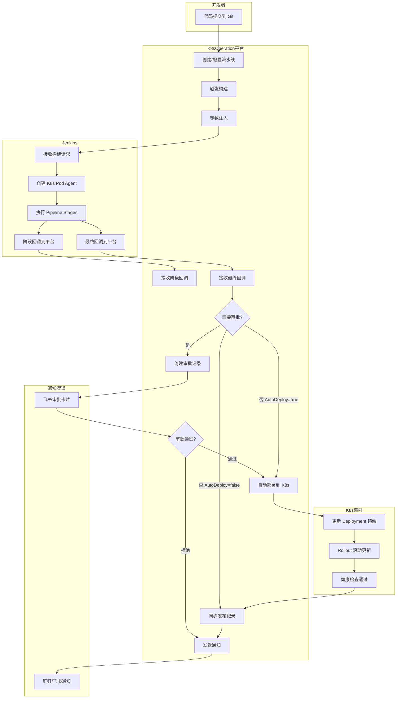
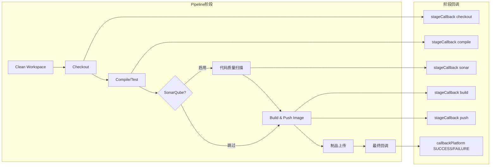
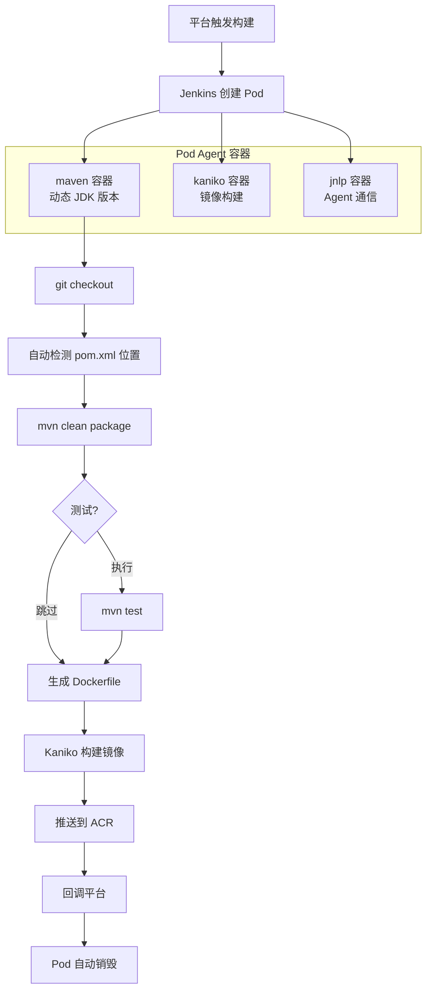
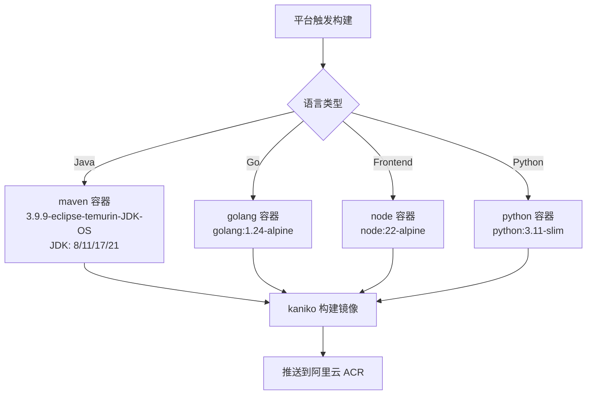
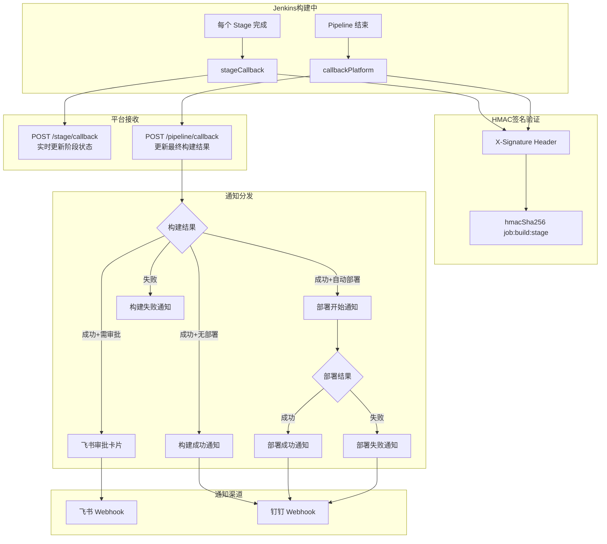

# K8sOperation CI/CD 完整流程图

## 一、总体架构流程



---

## 二、Jenkins Pipeline 阶段详细流程



---

## 三、Java 项目构建详细流程



---

## 四、发布审批流程（双路径）

```mermaid
graph TB
    subgraph 路径一：流水线自动发布
        A1[流水线构建成功] --> B1{RequireApproval?}
        B1 -->|是| C1[创建审批记录]
        C1 --> D1[发送飞书审批卡片]
        D1 --> E1{审批结果}
        E1 -->|通过| F1[执行自动部署]
        E1 -->|拒绝| G1[标记失败,通知]
        B1 -->|否,AutoDeploy=true| F1
        B1 -->|否,AutoDeploy=false| H1[仅记录,不部署]
    end

    subgraph 路径二：手动创建发布单
        A2[创建发布单] --> B2[强制创建审批]
        B2 --> C2{多级审批}
        C2 --> D2[第1级审批]
        D2 -->|通过| E2{还有下级?}
        E2 -->|是| F2[第N级审批]
        F2 --> E2
        E2 -->|全部通过| G2[入队执行部署]
        D2 -->|拒绝| H2[标记失败]
    end

    subgraph 部署执行
        F1 --> I[Patch K8s Workload]
        G2 --> I
        I --> J[等待 Rollout 完成]
        J --> K{部署成功?}
        K -->|是| L[发送成功通知]
        K -->|否| M[发送失败通知]
    end
```

---

## 五、多语言构建容器选择



---

## 六、回调与通知机制



---

## 七、数据流全景

```
┌──────────────┐     触发构建(API)      ┌──────────────┐     buildWithParameters     ┌──────────────┐
│              │ ──────────────────────▶ │              │ ──────────────────────────▶ │              │
│   前端 UI    │                         │   后端 API   │                             │   Jenkins    │
│  (Vue3)      │ ◀────────────────────── │   (Go/Gin)   │ ◀──────────────────────────  │              │
│              │     WebSocket/轮询       │              │   HTTP 回调(HMAC签名)       │              │
└──────────────┘                         └──────────────┘                             └──────────────┘
                                               │                                            │
                                               │ K8s API                                    │ K8s API
                                               ▼                                            ▼
                                         ┌──────────────┐                             ┌──────────────┐
                                         │  K8s 集群    │                             │  动态 Pod    │
                                         │  Deployment  │                             │  Build Agent │
                                         │  更新镜像    │                             │  (临时创建)  │
                                         └──────────────┘                             └──────────────┘
```

---

## 八、关键 API 端点

| 端点 | 方法 | 用途 |
|------|------|------|
| `/api/v1/k8s/cicd/pipeline/run` | POST | 触发流水线构建 |
| `/api/v1/k8s/cicd/pipeline/callback` | POST | Jenkins 最终构建回调 |
| `/api/v1/k8s/cicd/stage/callback` | POST | Jenkins 阶段实时回调 |
| `/api/v1/k8s/cicd/pipeline/sonar-callback` | POST | SonarQube 扫描结果回调 |
| `/api/v1/k8s/cicd/artifact/upload` | POST | 制品上传回调 |
| `/api/v1/k8s/cicd/approval/feishu-callback` | GET/POST | 飞书审批操作回调 |
| `/api/v1/k8s/cicd/callback/build` | POST | 发布单构建回调 |
| `/api/v1/k8s/cicd/release` | POST | 创建发布单 |
| `/api/v1/k8s/cicd/approval/:id` | PUT | 审批操作(通过/拒绝) |
