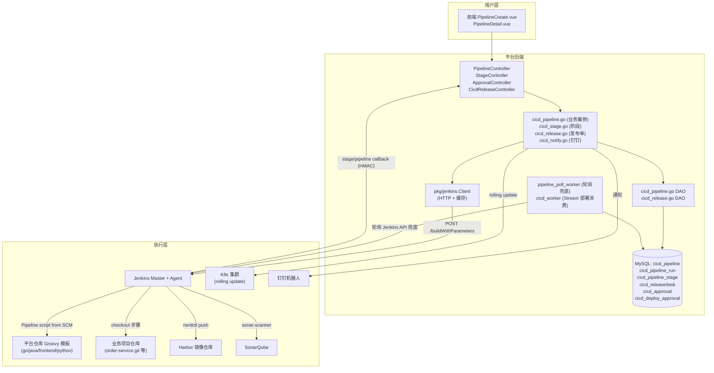
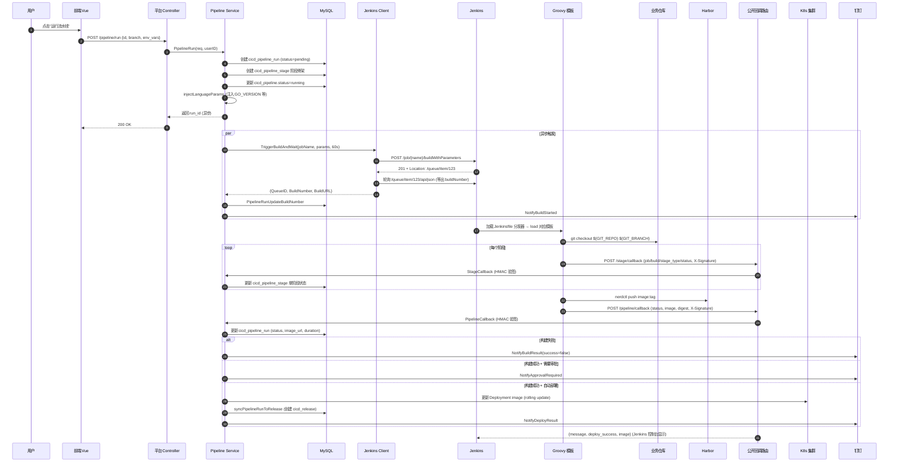
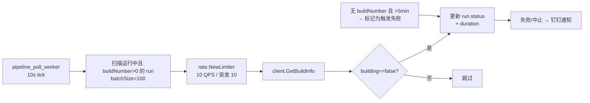
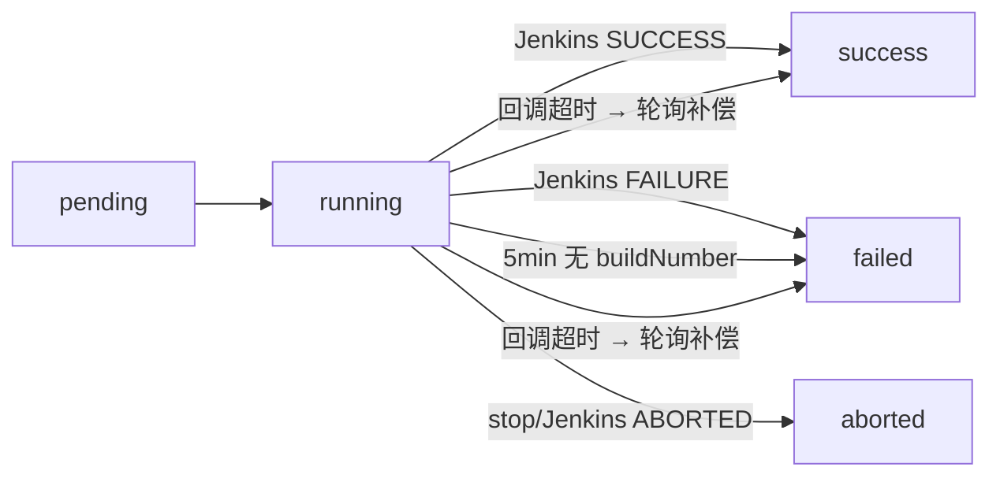
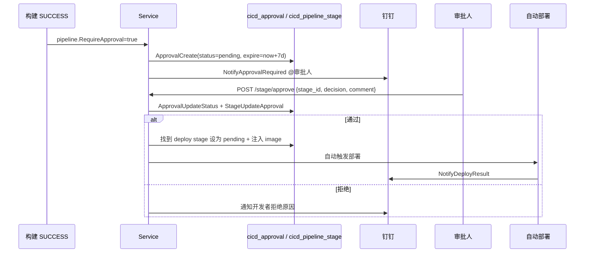
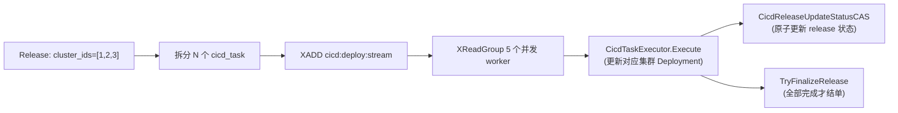

# Jenkins CICD 发布架构设计文档

> **版本**：v1.0  
> **作者**：K8sOperation 平台组  
> **更新日期**：2026-05-22  
> **适用范围**：本平台 `cicd_pipeline` / `cicd_release` 模块及其与 Jenkins、Harbor、SonarQube、K8s 的协作链路。

---

## 1. 文档概述

本文档系统性梳理 K8sOperation 平台 **基于 Jenkins 的 CICD 发布**端到端实现，覆盖：

- 平台后端 ↔ Jenkins ↔ K8s 的**三方协同时序**
- **模板化 Pipeline**（Go / Java / Frontend / Python）的工作机理
- **触发 → 构建 → 回调 → 审批 → 部署 → 通知**的全链路状态机
- 数据库表设计、HMAC 安全、轮询兜底、并发控制等关键工程决策

源码全景索引（点击跳转）：

| 层 | 文件 |
|---|---|
| Jenkins HTTP 客户端 | [pkg/jenkins/client.go](file:///D:/k8s-go/k8s_operation/pkg/jenkins/client.go) |
| 流水线 Service | [internal/app/services/cicd_pipeline.go](file:///D:/k8s-go/k8s_operation/internal/app/services/cicd_pipeline.go) |
| 阶段 Service | [internal/app/services/cicd_stage.go](file:///D:/k8s-go/k8s_operation/internal/app/services/cicd_stage.go) |
| 发布单 Service | [internal/app/services/cicd_release.go](file:///D:/k8s-go/k8s_operation/internal/app/services/cicd_release.go) |
| 通知 Service | [internal/app/services/cicd_notify.go](file:///D:/k8s-go/k8s_operation/internal/app/services/cicd_notify.go) |
| 业务路由 | [internal/app/routers/kube_cicd/cicd_router.go](file:///D:/k8s-go/k8s_operation/internal/app/routers/kube_cicd/cicd_router.go) |
| 公开回调路由 | [internal/app/routers/kube_cicd/cicd_callback_router.go](file:///D:/k8s-go/k8s_operation/internal/app/routers/kube_cicd/cicd_callback_router.go) |
| 部署任务 Worker | [internal/app/worker/cicd_worker.go](file:///D:/k8s-go/k8s_operation/internal/app/worker/cicd_worker.go) |
| Jenkins 轮询 Worker | [internal/app/worker/pipeline_poll_worker.go](file:///D:/k8s-go/k8s_operation/internal/app/worker/pipeline_poll_worker.go) |
| Pipeline 分发器 | [Jenkinsfile](file:///D:/k8s-go/k8s_operation/Jenkinsfile) |
| 多语言模板 | [configs/jenkins-templates/](file:///D:/k8s-go/k8s_operation/configs/jenkins-templates/) |

---

## 2. 设计目标与约束

| 目标 | 落地手段 |
|---|---|
| **零侵入业务项目** | 模板放在平台仓库，业务项目仅需 `Dockerfile`，**不需要 Jenkinsfile** |
| **多语言统一** | 1 个分发器（`Jenkinsfile`）+ 4 个语言模板（go/java/frontend/python） |
| **平台权威态** | 流水线/构建状态、镜像、阶段日志全部存平台 DB，Jenkins 仅作为执行器 |
| **回调安全** | 公开回调接口跳过 JWT，但用 HMAC-SHA256 签名校验请求真实性 |
| **断网自愈** | 即使 Jenkins 回调丢失，平台轮询 Worker 也会扫描 DB 主动拉取最终状态 |
| **生产可控** | 生产环境强制审批，审批通过后才触发自动部署，并落 `cicd_deploy_approval` 风险评估 |
| **可观测** | 阶段级回调（checkout/test/build/push/deploy）实时落 `cicd_pipeline_stage` 表 |

---

## 3. 总体架构

### 3.1 分层视图



### 3.2 模块职责

| 模块 | 职责 | 关键文件 |
|---|---|---|
| **Controller** | 参数校验、HMAC 验签、统一响应 | [pipeline_controller.go](file:///D:/k8s-go/k8s_operation/internal/app/controllers/api/v1/cicd/pipeline_controller.go) |
| **Service** | 业务编排（运行/停止/回调/部署/通知/同步发布单） | [cicd_pipeline.go](file:///D:/k8s-go/k8s_operation/internal/app/services/cicd_pipeline.go) |
| **DAO** | 流水线/运行/阶段/发布的 CRUD + CAS 状态机 | [internal/app/dao/cicd_*.go](file:///D:/k8s-go/k8s_operation/internal/app/dao/) |
| **Jenkins Client** | 触发/查询/取消构建、Job 信息缓存、HTTP 连接池 | [pkg/jenkins/client.go](file:///D:/k8s-go/k8s_operation/pkg/jenkins/client.go) |
| **Pipeline Poll Worker** | 轮询 Jenkins API 兜底回调丢失 | [pipeline_poll_worker.go](file:///D:/k8s-go/k8s_operation/internal/app/worker/pipeline_poll_worker.go) |
| **CICD Worker** | Redis Stream 消费部署任务（多集群并发） | [cicd_worker.go](file:///D:/k8s-go/k8s_operation/internal/app/worker/cicd_worker.go) |

---

## 4. 模板化设计

### 4.1 双仓库分离

平台触发一次 Jenkins 构建涉及 **两次 Git 拉取**：

| 维度 | 平台仓库（k8s_operation） | 业务项目仓库 |
|---|---|---|
| 谁拉取 | Jenkins Job 的 SCM 配置自动拉 | Groovy 模板的 `checkout` 步骤拉 |
| 拉什么 | `Jenkinsfile` 分发器 + 模板文件 | 业务源代码 |
| 配置在哪 | Jenkins Job → Pipeline → SCM | 平台流水线表的 `git_repo` 字段 |
| 触发时机 | 构建启动前（加载脚本） | 第一个 stage 执行 |

> **核心思想**：业务仓库**零侵入**，所有 CI 逻辑收敛到平台仓库，模板更新只需 `git push`，所有项目下次构建自动生效。

### 4.2 分发器（[Jenkinsfile](file:///D:/k8s-go/k8s_operation/Jenkinsfile)）

```groovy
def templateMap = [
    'go'      : 'configs/jenkins-templates/go-pipeline.groovy',
    'java'    : 'configs/jenkins-templates/java-spring-pipeline.groovy',
    'frontend': 'configs/jenkins-templates/frontend-pipeline.groovy',
    'python'  : 'configs/jenkins-templates/python-pipeline.groovy'
]

node {
    checkout scm
    def langType = params.LANGUAGE_TYPE?.trim() ?: 'go'
    def templateFile = templateMap[langType]
    load templateFile  // 动态加载对应语言模板
}
```

### 4.3 模板交叉校验

每个模板首阶段会做**类型自校**，防止 Jenkins Job 配错 `Script Path`：

```groovy
def expectedType = 'go'                            // 模板内固定值
def actualType = params.LANGUAGE_TYPE?.trim()       // 平台传入
if (actualType && actualType != expectedType) {
    error("=== 模板类型不匹配 ===\n平台配置: ${actualType}\n当前模板: ${expectedType}")
}
```

### 4.4 多语言模板能力矩阵

| 模板 | 缓存策略 | 工具 | 默认阶段 |
|---|---|---|---|
| `go-pipeline.groovy` | BuildKit 层缓存 `/var/lib/jenkins/.buildkit-cache` | go test + golangci-lint + nerdctl | checkout / dependencies / compile / test / lint / sonar / quality_gate / build_binary / upload_artifact / build / push |
| `java-spring-pipeline.groovy` | 保留 `.m2` Maven 仓库 | Maven 3.9 + JDK 21 + sonar-maven-plugin | checkout / dependencies / compile / test / sonar / quality_gate / build_binary / upload_artifact / build / push |
| `frontend-pipeline.groovy` | npm 缓存 | npm ci + sonar-scanner | checkout / dependencies / test / compile / sonar / quality_gate / build_binary / upload_artifact / build / push |
| `python-pipeline.groovy` | pip 缓存 | flake8 + pytest + sonar-scanner | checkout / dependencies / lint / test / sonar / quality_gate / build_binary / upload_artifact / build / push |

> 所有模板统一使用 `nerdctl push --concurrency 8` 并发推送，二次构建提速 50%+。

---

## 5. 核心数据流

### 5.1 端到端时序



### 5.2 兜底轮询机制



> **设计要点**：哪怕 Jenkins → 平台的网络断开导致回调丢失，5 个并行 worker 也会按 10 QPS 限流地拉取构建结果，**最多 10 秒内**收敛到 DB。

---

## 6. 关键组件详解

### 6.1 Jenkins Client（[pkg/jenkins/client.go](file:///D:/k8s-go/k8s_operation/pkg/jenkins/client.go)）

| 能力 | 实现要点 |
|---|---|
| **Job 信息缓存** | `jobInfoCache map[string]*cachedJobInfo` + RWMutex，5 分钟 TTL，避免 100 流水线同时触发打爆 Jenkins API |
| **HTTP 连接池** | 单个 BaseURL 共享 `*http.Client`，`GetOrCreateClient` 全局单例 |
| **触发构建分支** | 自动判断 `ParametersDefinitionProperty` / `WorkflowJob` 三类，参数化失败自动 fallback 无参构建 |
| **队列等待** | 触发后轮询 `/queue/item/{id}/api/json` 直到 `executable.number` 出现 |
| **状态映射** | `BuildStatusToRunStatus(building, result) → running/success/failed/aborted/pending` |
| **错误提取** | `extractJenkinsError` 从 HTML 错误页提取真实原因 |

```go
// 全局单例 - 复用连接池，无并发问题
return jenkins.GetOrCreateClient(
    jenkinsURL,
    global.JenkinsSetting.Username,
    global.JenkinsSetting.APIToken,
)
```

### 6.2 触发参数全集

平台调用 [PipelineRun()](file:///D:/k8s-go/k8s_operation/internal/app/services/cicd_pipeline.go) 时注入的参数集：

| 参数 | 来源 | 模板用途 |
|---|---|---|
| `LANGUAGE_TYPE` | `pipeline.language_type` | 模板交叉校验 |
| `GIT_REPO` / `GIT_BRANCH` | `pipeline.git_repo/branch` (可被 req 覆盖) | 业务代码拉取 |
| `IMAGE_REPO` / `IMAGE_TAG` | EnvVars 注入 | nerdctl 推送目标 |
| `DOCKERFILE_PATH` | `auto`/`project`/`platform` 三模式 | 平台兜底生成或用户路径 |
| `PIPELINE_ID` / `RUN_ID` | DB 新建记录主键 | 回调时关联记录 |
| `PLATFORM_CALLBACK_URL` | `JenkinsSetting.CallbackURL` + 路径 | Groovy `httpRequest` 回调地址 |
| `ARTIFACT_UPLOAD_URL` | 同上，路径替换为 `/artifact/upload` | 制品文件上传 |
| `GO_VERSION` / `JAVA_VERSION` / `NODE_VERSION` / `PYTHON_VERSION` | `injectLanguageParams` 默认值 | 工具链版本 |
| `ENABLE_SONAR` / `SONAR_QUALITY_GATE` | `pipeline.enable_sonar` | 质量门禁开关 |
| `ENABLE_ARTIFACT_UPLOAD` | `pipeline.enable_artifact_upload` | 制品上传开关 |
| `MAVEN_GOALS` / `BUILD_COMMAND` / `BUILD_OUTPUT_DIR` | 语言专属默认值 | Maven 目标 / 前端构建命令 |
| `SONAR_SOURCES` / `SONAR_EXCLUSIONS` | 语言专属默认值 | Sonar 扫描范围 |
| `EnvVars[*]` | 流水线表 `env_vars` JSON + 请求体 `env_vars` | 业务自定义参数（请求优先级更高） |

> **HMAC_SECRET 不通过参数传递**：Jenkins 端用 `withCredentials([credentials('hmac-secret')])` 读取，避免明文暴露。

### 6.3 双向回调

#### 阶段级回调（每个 stage 完成）

```http
POST /api/v1/k8s/cicd/stage/callback
X-Signature: <HMAC-SHA256(secret, "${JOB_NAME}:${BUILD_NUMBER}:${stage_type}")>
{
    "job_name": "go-pipeline",
    "build_number": 42,
    "pipeline_id": 15,
    "stage_type": "compile",
    "status": "success"
}
```

#### 最终回调（构建完成）

```http
POST /api/v1/k8s/cicd/pipeline/callback
X-Signature: <HMAC-SHA256(secret, "${JOB_NAME}:${BUILD_NUMBER}:${status}")>
{
    "job_name": "go-pipeline",
    "build_number": 42,
    "pipeline_id": 15,
    "status": "SUCCESS",            // SUCCESS/FAILURE/ABORTED
    "image_url": "harbor.x.com/lib/order:main-abc-1700000000",
    "image_digest": "sha256:...",
    "git_commit": "abc1234",
    "git_branch": "main",
    "duration_sec": 180,
    "build_url": "http://jenkins/job/go-pipeline/42/"
}
```

> 回调**响应体**会反射给 Jenkins，Groovy `consoleLogResponseBody: true` 会把 `deploy_success` / `namespace` / `image` 实时显示在 Jenkins 控制台。

### 6.4 HMAC 安全闭环

```go
// 平台侧：internal/app/services/cicd_pipeline.go
func computeHMAC(secret, jobName string, buildNumber int, status string) string {
    data := fmt.Sprintf("%s:%d:%s", jobName, buildNumber, status)
    h := hmac.New(sha256.New, []byte(secret))
    h.Write([]byte(data))
    return hex.EncodeToString(h.Sum(nil))
}
```

| 配置项 | 平台侧 | Jenkins 侧 |
|---|---|---|
| 密钥来源 | `config.yaml` → `Jenkins.HMACSecret` | Credentials → `hmac-secret` |
| 算法 | HMAC-SHA256 | `openssl dgst -sha256 -hmac` |
| 签名串 | `${job_name}:${build_number}:${status}` | 同左 |
| 验签失败 | `401 UnauthorizedTokenError` | — |
| 未配置密钥 | 跳过验证（开发模式 Warn 日志） | 模板内 `if (env.HMAC_SECRET?.trim())` 跳过签名 |

---

## 7. 状态机与表结构

### 7.1 流水线运行状态



### 7.2 关键表（[docs/sql/k8s_platform_full_init.sql](file:///D:/k8s-go/k8s_operation/docs/sql/k8s_platform_full_init.sql)）

| 表 | 用途 | 关键字段 |
|---|---|---|
| `cicd_pipeline` | 流水线定义 | `git_repo`, `language_type`, `jenkins_job`, `enable_sonar`, `target_cluster_id`, `target_namespace`, `target_workload_name`, `require_approval` |
| `cicd_pipeline_run` | 一次构建运行 | `pipeline_id`, `build_number`, `status`, `image_url`, `image_digest`, `duration_sec`, `git_commit`, `trigger_user_id` |
| `cicd_pipeline_stage` | 单个阶段执行 | `run_id`, `stage_type`, `status`, `started_at`, `finished_at`, `approval_user_id`, `approval_decision` |
| `cicd_release` | 发布单（CI 完成后自动同步） | `app_name`, `image_repo`, `image_tag`, `cluster_ids`, `strategy`, `status` |
| `cicd_task` | 发布单下的子任务（按集群拆分） | `release_id`, `cluster_id`, `status`, `prev_image`（用于回滚） |
| `cicd_approval` | 阶段级审批记录 | `pipeline_id`, `stage_id`, `status`, `expire_time` (默认 7 天) |
| `cicd_deploy_approval` | 生产发布资源风险审批 | `risk_level`, `risk_warnings`, `requested_config`, `current_config` |
| `cicd_environment` | 环境定义（dev/test/staging/prod） | `cluster_id`, `namespace`, `require_approval`, `approval_users` |

---

## 8. 审批闭环

### 8.1 触发条件

```go
// cicd_pipeline.go - PipelineCallback
if runStatus == PipelineRunStatusSuccess && pipeline.RequireApproval {
    go s.NotifyApprovalRequired(ctx, pipeline, run)   // 钉钉 @审批人
} else {
    go s.NotifyBuildResult(ctx, pipeline, run, ok)
}
```

### 8.2 审批流程



### 8.3 风险评估（生产级）

`cicd_deploy_approval` 表对生产环境发布做**资源配置 diff + 风险打分**：

| 风险等级 | 触发条件示例 |
|---|---|
| `low` | 镜像版本升级、副本数变化在 ±20% 内 |
| `medium` | CPU/内存 limit 提高 50% 以上、副本数翻倍 |
| `high` | 删除资源、跨命名空间发布、生产环境首次部署 |

---

## 9. 自动部署与发布单

### 9.1 单集群自动部署

构建成功 → 调用 `autoDeployToK8sWithResult` → 异步 `executeAutoDeployAsync`：

1. 根据 `target_cluster_id` 获取 `kubernetes.Clientset`
2. 按 `target_workload_kind` (Deployment/StatefulSet/DaemonSet) 取资源
3. **只更新 `target_container` 的镜像**（保留其他配置）
4. 等待 Rollout 完成（含超时）
5. 钉钉通知部署结果

### 9.2 多集群发布单

通过 [cicd_worker.go](file:///D:/k8s-go/k8s_operation/internal/app/worker/cicd_worker.go) 的 **Redis Stream** 消费：



> **CAS（Compare-And-Swap）** 防止 N 个 worker 并发更新 release 状态产生竞态。
> **prev_image** 落库即支持一键回滚。

---

## 10. REST API 总览

### 10.1 流水线（需 JWT）

| 方法 | 路径 | 用途 |
|---|---|---|
| POST | `/api/v1/k8s/cicd/pipeline/create` | 创建流水线 |
| POST | `/api/v1/k8s/cicd/pipeline/batch-create` | 批量导入（最多 100 个） |
| POST | `/api/v1/k8s/cicd/pipeline/run` | 触发构建 |
| POST | `/api/v1/k8s/cicd/pipeline/stop` | 停止构建 |
| POST | `/api/v1/k8s/cicd/pipeline/batch-run` / `/batch-stop` | 批量操作 |
| GET | `/api/v1/k8s/cicd/pipeline/logs` | 拉取 Jenkins 控制台日志 |
| GET | `/api/v1/k8s/cicd/pipeline/stages` | Jenkins Pipeline 阶段图 |
| GET | `/api/v1/k8s/cicd/pipeline/sonar-report` | SonarQube 质量报告 |

### 10.2 公开回调（跳过 JWT，HMAC 验签）

| 方法 | 路径 | 用途 |
|---|---|---|
| POST | `/api/v1/k8s/cicd/pipeline/callback` | 构建完成最终回调 |
| POST | `/api/v1/k8s/cicd/pipeline/sonar-callback` | SonarQube Webhook |
| POST | `/api/v1/k8s/cicd/stage/callback` | 阶段实时回调 |
| POST | `/api/v1/k8s/cicd/callback/build` | 发布单构建回调 |
| POST | `/api/v1/k8s/cicd/artifact/upload` | 制品文件上传 |

### 10.3 阶段、审批、发布单

| 路径前缀 | 用途 |
|---|---|
| `/api/v1/k8s/cicd/stage/*` | approve / deploy / cancel / rollback / history |
| `/api/v1/k8s/cicd/approval/*` | 审批列表 / pending / 操作 |
| `/api/v1/k8s/cicd/release/*` | 发布单 CRUD / 取消 / 回滚 / 重试 / 批量操作 |
| `/api/v1/k8s/cicd/resource/*` | 资源模板 / 规则 / 风险审批 |
| `/api/v1/k8s/cicd/artifact/*` | 制品库 |

---

## 11. 关键设计决策（ADR）

### ADR-1：模板放在平台仓库而非业务项目
- **理由**：100+ 业务项目零侵入，集中维护更新；用 `Pipeline script from SCM` 利用 Jenkins 原生能力。
- **代价**：业务项目必须配 `Dockerfile`（或允许平台兜底生成）。

### ADR-2：异步触发 + 同步等待 buildNumber
- **代价**：阻塞 60 秒等队列消费。
- **收益**：拿到 `BuildNumber` 才能后续轮询/查询日志，否则用户根本不知道在 Jenkins 哪一次构建。
- **兜底**：`5min 无 buildNumber → 标记触发失败`，由轮询 Worker 兜底回收。

### ADR-3：回调 + 轮询双轨制
- **回调**：实时性强但依赖网络可达。
- **轮询**：10 秒粒度，5 worker 并发，10 QPS 限流。
- **取舍**：用回调做主路径（毫秒级响应），轮询保证最终一致性，开发/生产都可用。

### ADR-4：HMAC 签名而非 OAuth/JWT
- **理由**：Jenkins 是无状态执行器，使用对称密钥比申请/续期 token 更轻量。
- **限制**：密钥泄露需手工轮换。生产建议每 90 天轮换一次。

### ADR-5：`injectLanguageParams` 服务端注入而非用户填
- **理由**：`GO_VERSION=1.24` / `JAVA_VERSION=17` / `NODE_VERSION=18` 等由平台统一升级，避免 100 个流水线散落不同版本。
- **可覆盖**：`pipeline.env_vars` 和请求 `env_vars`（优先级最高）允许特殊业务覆盖。

### ADR-6：构建成功自动同步发布单
- **理由**：用户在 CI 视角看构建，运维在 CD 视角看发布；同步落 `cicd_release` 后两个视角自然合一。
- **位置**：`syncPipelineRunToRelease`，幂等通过 `RequestID = "pipeline-sync-{run_id}"` 保证。

### ADR-7：发布任务用 Redis Stream 而非 DB 队列
- **理由**：多集群并行需要并发消费 + 消费者组 + 重启不丢消息，Stream 自带 `XACK` + `XPENDING`。
- **代价**：依赖 Redis（已是平台必选项）。

---

## 12. 配置与启动

### 12.1 平台 [config.yaml](file:///D:/k8s-go/k8s_operation/configs/config.yaml)

```yaml
Jenkins:
  URL: "http://jenkins.example.com"
  Username: "admin"
  APIToken: "11xxx..."             # 在 Jenkins 用户设置中生成
  CallbackURL: "http://platform.example.com:8080"   # 平台对外可达地址
  HMACSecret: "your-32-bytes-secret"                  # 与 Jenkins credential 一致
  TriggerTimeout: 60        # 触发等待 buildNumber 的超时(秒)
  PollInterval: 10          # 轮询周期(秒)
  MaxBuildTime: 30          # 单次构建最长允许时间(分钟)
```

### 12.2 Jenkins 端

| Credentials ID | 类型 | 用途 |
|---|---|---|
| `harbor-registry` | Username/Password | nerdctl push 凭证 |
| `hmac-secret` | Secret text | 平台回调签名密钥 |
| `gitee-id` | Username/Password 或 SSH | 业务/平台仓库拉取 |

每个 Job 配置：
- **Definition**：Pipeline script from SCM
- **SCM Repository**：平台仓库地址
- **Script Path**：`Jenkinsfile` （推荐分发器）或 `configs/jenkins-templates/<lang>-pipeline.groovy`

---

## 13. 运维与排错

### 13.1 常见故障速查

| 现象 | 排查 | 修复 |
|---|---|---|
| 触发 5 分钟后超时 | `pipeline_poll_worker` 日志 / Jenkins Job 不存在 | 检查 `JenkinsSetting.URL` 可达；Job 名是否与 `DefaultJenkinsJobMap[lang]` 一致 |
| 回调 401 | `[回调] HMAC 签名验证失败` | 平台 `HMACSecret` ≠ Jenkins credential `hmac-secret` |
| 阶段一直 pending | `/stage/callback` 无日志 | 模板内 `params.PLATFORM_CALLBACK_URL` 未注入；Jenkins → 平台网络不通 |
| 镜像未推 Harbor | nerdctl push 阶段失败 | `harbor-registry` 凭证错误；BuildKit 缓存目录无写权限 |
| 部署后 image 没变 | `target_container` 配置错误 | 容器名拼错；workload 多容器时只更新指定容器 |
| 模板类型不匹配 | 模板内 `error('=== 模板类型不匹配 ===')` | Job 的 `Script Path` 指向错误的语言模板 |

### 13.2 SQL 速查

```sql
-- 最近 10 次运行
SELECT id, pipeline_id, build_number, status, image_url, duration_sec
FROM cicd_pipeline_run ORDER BY id DESC LIMIT 10;

-- 卡住的运行（无 buildNumber 且 >5 分钟）
SELECT * FROM cicd_pipeline_run
WHERE build_number = 0 AND status = 'running'
  AND created_at < UNIX_TIMESTAMP() - 300;

-- 待审批
SELECT * FROM cicd_approval WHERE status = 'pending' AND expire_time > UNIX_TIMESTAMP();

-- 失败的部署任务
SELECT t.id, t.release_id, t.cluster_id, t.status, t.message
FROM cicd_task t WHERE t.status = 'Failed' ORDER BY t.id DESC LIMIT 20;
```

---

## 14. 改进路线

| 优先级 | 项 | 说明 |
|---|---|---|
| P0 | 阶段日志按行流式推送 | 当前阶段日志依赖 Jenkins API 拉取整段，可改为 Jenkins → Loki → 前端 SSE |
| P0 | HMAC 密钥轮换 | 引入 `kid` (Key ID) 头，支持新旧两把密钥并存 7 天 |
| P1 | 多 Jenkins Master 支持 | `pipeline.jenkins_url` 字段已留好，DAO 已支持，需要前端提供选择器 |
| P1 | 制品签名 (cosign) | 镜像 push 后用 cosign 签名，Admission Controller 校验 |
| P2 | 流水线 DAG 可视化 | 当前阶段表是平铺，引入 `depends_on` 字段支持并行/依赖图 |
| P2 | 蓝绿/金丝雀发布 | 当前只支持 RollingUpdate，可扩展 `strategy=blue-green` 走 Argo Rollouts |
| P3 | Tekton/Argo Workflow 后端 | Service 层抽 `BuildExecutor` interface，可替换 Jenkins 实现 |

---

## 15. 附录

### 15.1 文件索引

| 模块 | 文件 |
|---|---|
| Jenkins 客户端 | [pkg/jenkins/client.go](file:///D:/k8s-go/k8s_operation/pkg/jenkins/client.go) |
| Service 层 | [cicd_pipeline.go](file:///D:/k8s-go/k8s_operation/internal/app/services/cicd_pipeline.go) / [cicd_stage.go](file:///D:/k8s-go/k8s_operation/internal/app/services/cicd_stage.go) / [cicd_release.go](file:///D:/k8s-go/k8s_operation/internal/app/services/cicd_release.go) / [cicd_notify.go](file:///D:/k8s-go/k8s_operation/internal/app/services/cicd_notify.go) / [cicd_environment.go](file:///D:/k8s-go/k8s_operation/internal/app/services/cicd_environment.go) |
| Worker | [pipeline_poll_worker.go](file:///D:/k8s-go/k8s_operation/internal/app/worker/pipeline_poll_worker.go) / [cicd_worker.go](file:///D:/k8s-go/k8s_operation/internal/app/worker/cicd_worker.go) / [cicd_callback.go](file:///D:/k8s-go/k8s_operation/internal/app/worker/cicd_callback.go) |
| 路由 | [cicd_router.go](file:///D:/k8s-go/k8s_operation/internal/app/routers/kube_cicd/cicd_router.go) / [cicd_callback_router.go](file:///D:/k8s-go/k8s_operation/internal/app/routers/kube_cicd/cicd_callback_router.go) |
| Pipeline 分发器 | [Jenkinsfile](file:///D:/k8s-go/k8s_operation/Jenkinsfile) |
| 多语言模板 | [go-pipeline.groovy](file:///D:/k8s-go/k8s_operation/configs/jenkins-templates/go-pipeline.groovy) / [java-spring-pipeline.groovy](file:///D:/k8s-go/k8s_operation/configs/jenkins-templates/java-spring-pipeline.groovy) / [frontend-pipeline.groovy](file:///D:/k8s-go/k8s_operation/configs/jenkins-templates/frontend-pipeline.groovy) / [python-pipeline.groovy](file:///D:/k8s-go/k8s_operation/configs/jenkins-templates/python-pipeline.groovy) |
| 数据库 | [docs/sql/k8s_platform_full_init.sql](file:///D:/k8s-go/k8s_operation/docs/sql/k8s_platform_full_init.sql) |

### 15.2 相关文档

- [CI_CD_模板化架构与触发机制说明.md](file:///D:/k8s-go/k8s_operation/docs/CI_CD_%E6%A8%A1%E6%9D%BF%E5%8C%96%E6%9E%B6%E6%9E%84%E4%B8%8E%E8%A7%A6%E5%8F%91%E6%9C%BA%E5%88%B6%E8%AF%B4%E6%98%8E.md)
- [CI_CD_流水线阶段化与通知闭环.md](file:///D:/k8s-go/k8s_operation/docs/CI_CD_%E6%B5%81%E6%B0%B4%E7%BA%BF%E9%98%B6%E6%AE%B5%E5%8C%96%E4%B8%8E%E9%80%9A%E7%9F%A5%E9%97%AD%E7%8E%AF.md)
- [CICD_发布流程与镜像仓库架构说明.md](file:///D:/k8s-go/k8s_operation/docs/CICD_%E5%8F%91%E5%B8%83%E6%B5%81%E7%A8%8B%E4%B8%8E%E9%95%9C%E5%83%8F%E4%BB%93%E5%BA%93%E6%9E%B6%E6%9E%84%E8%AF%B4%E6%98%8E.md)
- [CICD_多集群与混合云发布能力总览.md](file:///D:/k8s-go/k8s_operation/docs/CICD_%E5%A4%9A%E9%9B%86%E7%BE%A4%E4%B8%8E%E6%B7%B7%E5%90%88%E4%BA%91%E5%8F%91%E5%B8%83%E8%83%BD%E5%8A%9B%E6%80%BB%E8%A7%88.md)
- [生产环境CICD发布设计规范.md](file:///D:/k8s-go/k8s_operation/docs/%E7%94%9F%E4%BA%A7%E7%8E%AF%E5%A2%83CICD%E5%8F%91%E5%B8%83%E8%AE%BE%E8%AE%A1%E8%A7%84%E8%8C%83.md)
- [模板化CICD快速接入指南.md](file:///D:/k8s-go/k8s_operation/docs/%E6%A8%A1%E6%9D%BF%E5%8C%96CICD%E5%BF%AB%E9%80%9F%E6%8E%A5%E5%85%A5%E6%8C%87%E5%8D%97.md)

### 15.3 术语表

| 术语 | 含义 |
|---|---|
| **Pipeline** | 平台流水线定义（`cicd_pipeline` 表的一行） |
| **Run** | 一次具体的构建运行（`cicd_pipeline_run` 表的一行，对应 Jenkins build 一次） |
| **Stage** | 流水线内的一个阶段（checkout/test/build/push/deploy/approval） |
| **Release** | 发布单（一次面向多集群的部署活动） |
| **Task** | Release 拆分到单集群的部署子任务 |
| **CAS** | Compare-And-Swap，并发安全的状态原子更新 |
| **HMAC** | Hash-based Message Authentication Code，对称密钥消息签名 |
| **BuildKit 缓存** | Docker BuildKit 的层缓存目录，加速二次构建 |

---

> **文档维护人**：CICD 模块负责人  
> **更新规约**：新增模板/字段/Stage 类型时，必须同步更新本文档第 4、6、7 节。
