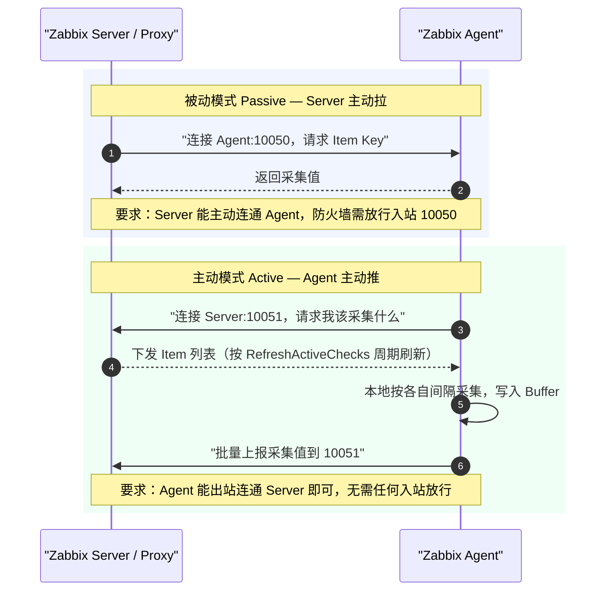
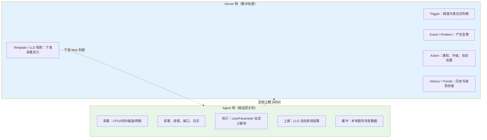
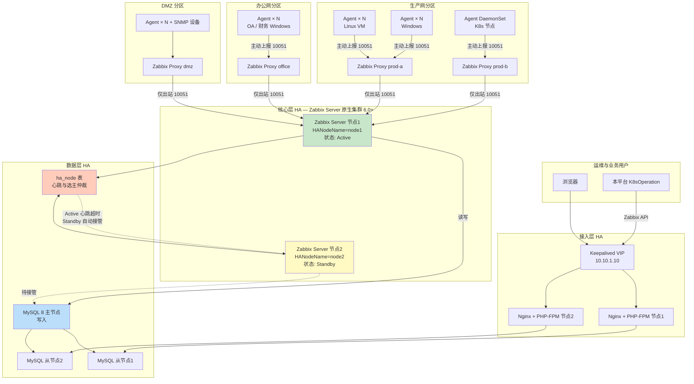
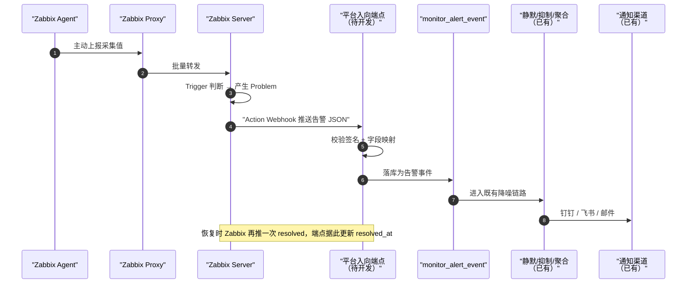
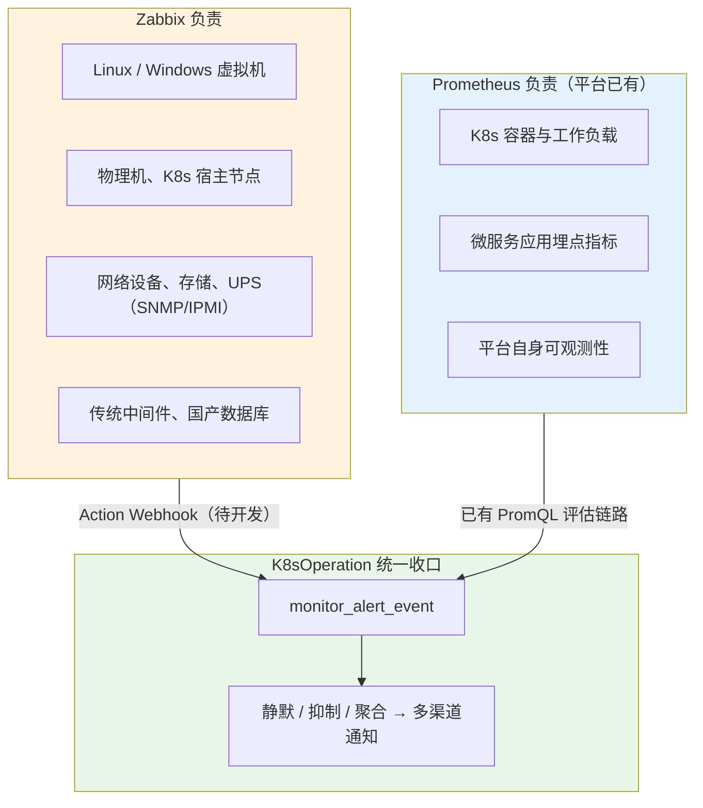

# Zabbix Agent 概念与国企高可用监控架构设计

> 版本: v1.0 | 状态: 设计中 | 更新时间: 2026-08-04
>
> 基准版本: **Zabbix 7.0 LTS**（涉及 6.0 LTS 差异处会单独标注）
>
> 适用范围: 国企/央企内网多网络分区环境，混合监控虚拟机、Windows 服务器与 K8s Pod

## 一、为什么在已有 Prometheus 的前提下还要 Zabbix

本平台现有监控体系是 Prometheus 系（`monitor_datasource.type` 枚举为 `prometheus/loki/alertmanager/grafana/victoriametrics`，告警规则 `monitor_alert_rule.expr` 是 PromQL）。引入 Zabbix **不是替换，而是补上 Prometheus 不擅长的那一半**。

| 维度 | Prometheus | Zabbix | 结论 |
|------|-----------|--------|------|
| K8s / 容器 | 原生，服务发现完善 | 需额外模板，体验一般 | **K8s 继续用 Prometheus** |
| 传统虚拟机 / 物理机 | 需逐个部署 exporter | Agent 一装到底，模板开箱即用 | **VM 用 Zabbix** |
| Windows 服务器 | wmi_exporter 生态弱 | 原生支持性能计数器、服务、事件日志 | **Windows 用 Zabbix** |
| 网络设备 / 存储 / UPS | 几乎空白 | SNMP/IPMI 一等公民 | **只能 Zabbix** |
| 中间件（Oracle/达梦/WebLogic） | exporter 参差不齐 | 官方模板 + 自定义 UserParameter | **Zabbix 更省事** |
| 数据模型 | 多维标签，适合动态负载 | 主机+监控项，适合固定资产 | 各有所长 |
| 网络穿透（多分区、单向策略） | 必须 Server 能连通被采集端 | **Agent 主动模式只需出站** | **Zabbix 明显更适配国企网络** |

国企环境的真实构成通常是：少量 K8s 集群 + 大量存量虚拟机 + 一批 Windows 业务服务器 + 网络设备与传统中间件，且被防火墙切成多个互不可达的网络分区。这种形态下 Zabbix 的 Agent 主动模式 + Proxy 分区采集，是比"到处塞 exporter + 打通网络"成本低得多的方案。

## 二、Zabbix Agent 是什么

### 2.1 概念

Zabbix Agent 是部署在**被监控主机**上的轻量采集进程。它自身不做判断、不存历史、不发告警，只负责一件事：**按 Server/Proxy 下发的监控项（Item）采集数值并回传**。阈值判断、告警产生、通知发送全部在 Server 侧完成。

理解 Agent 只需抓住四个概念：

| 概念 | 说明 |
|------|------|
| **Host（主机）** | Server 侧的被监控对象，与 Agent 通过 `Hostname` 或自动注册关联 |
| **Item（监控项）** | 一个采集点，由 **Key** 唯一标识，如 `system.cpu.util[,idle]`、`vfs.fs.size[/,pfree]` |
| **Template（模板）** | 一组 Item + Trigger + Graph 的集合，挂到主机上即批量生效，是规模化的关键 |
| **LLD（低级别自动发现）** | Agent 上报"我有哪些磁盘/网卡/服务"，Server 据此**自动创建** Item，无需人工枚举 |

LLD 是国企场景里最该用足的能力：几百台机器磁盘分区各不相同，靠人工配置监控项不可能维护，靠 `vfs.fs.discovery` 自动发现才可持续。

### 2.2 Agent 1 与 Agent 2 选型

| 对比项 | Agent 1（`zabbix_agentd`） | Agent 2（`zabbix_agent2`） |
|--------|---------------------------|---------------------------|
| 实现语言 | C | Go |
| 进程模型 | 多进程（每个 Collector 一个） | 单进程 + goroutine，资源占用更低 |
| 插件扩展 | 只能靠 `UserParameter` 调外部脚本 | 原生插件（MySQL/PostgreSQL/Redis/Docker/Ceph…），**无需外部脚本** |
| 持久化缓冲 | 无，Server 不可达时数据丢失 | `EnablePersistentBuffer=1`，落盘缓冲，断网不丢数据 |
| 单连接多指标 | 不支持 | 支持，减少连接开销 |
| 信创平台包 | 覆盖更广，老系统更稳 | 部分国产系统需自行编译 |

**选型建议**：

- 新建、且系统较新（麒麟 V10 / 统信 UOS / OpenEuler 22+）→ **Agent 2**，尤其看重 `EnablePersistentBuffer` 断网不丢数
- 存量老系统（CentOS 6/7、Windows Server 2008 R2）→ **Agent 1**，兼容性优先
- 两者可在同一 Zabbix Server 下混用，Server 无感知

### 2.3 被动模式 vs 主动模式（**最关键的一个知识点**）

这是 Agent 唯一必须想清楚的设计决策，直接决定架构能否在国企网络里落地。



| 对比项 | 被动模式 | 主动模式 |
|--------|---------|---------|
| 连接发起方 | Server → Agent | **Agent → Server** |
| 端口 | Agent 监听 `10050` | Server/Proxy 监听 `10051` |
| 防火墙 | 需放行**入站** 10050 | 只需放行**出站** 10051 |
| NAT / 跨分区 | 基本不可用 | **可用** |
| Server 负载 | 高（主动轮询每台） | 低（Agent 自己调度） |
| 数据缓冲 | 无 | 有（Agent 2 可持久化） |
| 主机数量扩展性 | 差 | 好 |
| 容器/弹性节点 | 不适用（IP 漂移） | **适用**（配合自动注册） |

> **国企场景结论：一律使用主动模式。**
>
> 原因有三：① 网络分区间通常只允许单向出站，被动模式过不去；② 安全评审很难批准在几百台业务机上开放监听端口；③ K8s Pod 与云主机 IP 不固定，被动模式无法寻址。
>
> 主动模式的代价是 Agent 侧配置必须写对 `ServerActive` 与 `Hostname`，且 Server 上的主机名必须与之严格一致，否则数据无处归属——这是实际部署中最高频的故障点，见第九章排障。

### 2.4 核心配置项速查

```ini
# /etc/zabbix/zabbix_agent2.conf —— 主动模式最小可用配置

# 【必填】上报目标。可写多个（逗号分隔）实现双 Proxy 冗余
# 同时写多个地址 = 向每一个都上报（各自独立），不是主备切换
ServerActive=10.10.1.11:10051,10.10.1.12:10051

# 【必填】必须与 Zabbix Server 上创建的主机名【完全一致】，否则数据被丢弃
Hostname=prod-app-01

# 被动模式的允许来源白名单。纯主动模式下仍建议填写，便于 Server 侧连通性探测
Server=10.10.1.11,10.10.1.12

# 自动注册用元数据：Server 侧可按此字符串匹配动作，自动建主机 + 挂模板
HostMetadata=linux,prod,payment

# 主动检查列表刷新周期（秒）。默认 120，大规模时适当调大以减轻 Server 压力
RefreshActiveChecks=120

# 发送缓冲：BufferSend 秒或攒满 BufferSize 条即上报
BufferSize=1000
BufferSend=5

# 【Agent 2 独有】持久化缓冲：Server 不可达时数据落盘，恢复后补传
EnablePersistentBuffer=1
PersistentBufferFile=/var/lib/zabbix/agent2.db
PersistentBufferPeriod=1h

# 传输加密（等保要求，见第七章）
TLSConnect=psk
TLSAccept=psk
TLSPSKIdentity=PSK-prod-payment
TLSPSKFile=/etc/zabbix/zabbix_agent2.psk

# 允许执行远程命令：等保场景建议保持 0（禁用）
EnableRemoteCommands=0
```

> `ServerActive` 写多个地址的语义是**同时向每个地址上报**，不是主备。真正的 Proxy 故障转移要靠 7.0 的 Proxy 组（见 5.3），6.0 及以下只能靠双份上报或 VIP。

## 三、Agent 的作用边界

明确 Agent **做什么、不做什么**，能避免大量架构误解。



**Agent 不负责**：阈值判断、告警抑制、通知发送、数据长期存储。所有这些都在 Server。这意味着：

- Agent 挂了 → Server 侧 `nodata()` 触发器会报"主机失联"，**这是必须配的**，否则 Agent 静默死亡无人知晓
- 想改阈值 → 只改 Server，无需动任何一台 Agent
- Agent 版本可落后于 Server（官方支持较宽的向后兼容），**但 Agent 不能新于 Server**

## 四、三种运行形态

### 4.1 虚拟机 / 物理机（Linux）

最标准的形态，占国企资产的绝大多数。

```bash
# 麒麟 V10 / OpenEuler 示例（内网需先配好私有 yum 源，见 7.3）
yum install -y zabbix-agent2

# 关键配置（主动模式）
cat > /etc/zabbix/zabbix_agent2.conf <<'EOF'
ServerActive=10.10.1.11:10051,10.10.1.12:10051
Hostname=prod-app-01
HostMetadata=linux,prod,payment
EnablePersistentBuffer=1
PersistentBufferFile=/var/lib/zabbix/agent2.db
TLSConnect=psk
TLSAccept=psk
TLSPSKIdentity=PSK-prod-payment
TLSPSKFile=/etc/zabbix/zabbix_agent2.psk
EOF

# PSK 权限必须收紧，否则 Agent 拒绝启动
chmod 600 /etc/zabbix/zabbix_agent2.psk
chown zabbix:zabbix /etc/zabbix/zabbix_agent2.psk

systemctl enable --now zabbix-agent2
```

**常用监控项**：

| 类别 | Item Key 示例 | 说明 |
|------|--------------|------|
| CPU | `system.cpu.util[,idle]` | 取 idle 反算使用率更稳 |
| 内存 | `vm.memory.size[pavailable]` | 可用内存百分比 |
| 磁盘空间 | `vfs.fs.size[/,pfree]` | 配合 `vfs.fs.discovery` 做 LLD |
| 磁盘 IO | `vfs.dev.read[sda,ops]` | |
| 网络 | `net.if.in[eth0,bytes]` | 配合 `net.if.discovery` |
| 进程存活 | `proc.num[nginx]` | 业务进程守护 |
| 端口存活 | `net.tcp.listen[8080]` | |
| 日志关键字 | `log[/var/log/app.log,ERROR,,,skip]` | **主动模式专属**，被动模式不支持 |
| 自定义 | `UserParameter=biz.queue.len,/opt/scripts/queue.sh` | 业务指标兜底手段 |

> `log[]`、`logrt[]`、`eventlog[]` 这类**有状态**的监控项**只能在主动模式下工作**，因为需要 Agent 记住上次读取位置。这也是主动模式的又一个理由。

### 4.2 Windows 服务器

国企大量 OA、财务、报表类系统跑在 Windows 上，这是 Zabbix 相对 Prometheus 的最大优势区。

```powershell
# 静默安装（MSI 方式，可批量下发）
msiexec /i zabbix_agent2-7.0.0-windows-amd64-openssl.msi /qn `
  SERVERACTIVE="10.10.1.11:10051,10.10.1.12:10051" `
  HOSTNAME="win-oa-01" `
  HOSTMETADATA="windows,prod,oa" `
  ENABLEPATH=1 `
  TLSCONNECT=psk TLSACCEPT=psk `
  TLSPSKIDENTITY="PSK-prod-oa" `
  TLSPSKFILE="C:\Program Files\Zabbix Agent 2\agent.psk"

# 验证服务状态
Get-Service "Zabbix Agent 2"
```

**Windows 专属监控项**（Linux 上不存在，是选择 Zabbix 的核心理由）：

| Item Key | 用途 |
|----------|------|
| `service.info[MSSQLSERVER,state]` | Windows 服务状态，返回 0 表示运行中 |
| `service.discovery` | LLD 自动发现所有服务 |
| `perf_counter["\Processor(_Total)\% Processor Time"]` | 任意性能计数器 |
| `perf_counter_en[...]` | **英文计数器名**，中文版 Windows 上必须用这个 |
| `wmi.get[root\cimv2,"SELECT Status FROM Win32_DiskDrive"]` | 任意 WMI 查询 |
| `eventlog[Application,,"Error",,,,skip]` | 事件日志监控 |
| `proc_info[sqlservr.exe,wkset]` | 进程内存占用 |

> **中文版 Windows 的坑**：`perf_counter[]` 使用本地化计数器名，中文系统上 `"\Processor(_Total)\% Processor Time"` 会失败。**统一使用 `perf_counter_en[]`**，它固定用英文名，跨语言版本一致。这是 Windows 监控最高频的踩坑点。
>
> 另需注意：Windows 上 Agent 默认以 `LocalSystem` 运行；若要监控域账号相关或访问网络共享的指标，需改服务登录账号，并同步评审最小权限。

### 4.3 K8s Pod

**先明确一个判断**：K8s 集群内的容器与工作负载指标，**继续用 Prometheus，不要用 Zabbix Agent**。Zabbix 的主机+监控项模型对付动态 Pod 很别扭，而本平台已有成熟的 Prometheus 链路。

Zabbix Agent 在 K8s 里只在三个场景值得部署：

| 场景 | 部署方式 | 理由 |
|------|---------|------|
| **节点（宿主机）级监控** | DaemonSet | 与 VM 使用同一套模板和告警口径，纳管视角统一 |
| **Pod 内传统中间件**（如容器化的 Oracle/WebLogic） | Sidecar | 复用 Zabbix 现成的中间件模板 |
| **纳管视角统一**（运维希望所有资产在一个 CMDB 视图里） | DaemonSet | 组织流程需求，而非技术需求 |

```yaml
# DaemonSet 形态：监控 K8s 节点宿主机
apiVersion: apps/v1
kind: DaemonSet
metadata:
  name: zabbix-agent2
  namespace: monitoring
spec:
  selector:
    matchLabels: { app: zabbix-agent2 }
  template:
    metadata:
      labels: { app: zabbix-agent2 }
    spec:
      # 关键：共享宿主机命名空间，才能看到宿主机的真实指标
      hostNetwork: true
      hostPID: true
      dnsPolicy: ClusterFirstWithHostNet
      tolerations:
        - operator: Exists          # 确保 master/污点节点也覆盖
      containers:
        - name: agent
          image: harbor.internal/zabbix/zabbix-agent2:7.0.0
          env:
            - name: ZBX_ACTIVE_SERVERS
              value: "10.10.1.11:10051,10.10.1.12:10051"
            # 用节点名作为 Zabbix 主机名，保证与 Server 侧一致且稳定
            - name: ZBX_HOSTNAME
              valueFrom:
                fieldRef: { fieldPath: spec.nodeName }
            # 自动注册元数据：Server 侧据此自动建主机并挂 Linux 模板
            - name: ZBX_HOSTMETADATA
              value: "linux,k8s-node,prod"
            - name: ZBX_TLSCONNECT
              value: "psk"
            - name: ZBX_TLSPSKIDENTITY
              value: "PSK-k8s-node"
            - name: ZBX_TLSPSKFILE
              value: "/var/lib/zabbix/enc/psk"
          volumeMounts:
            - { name: psk,      mountPath: /var/lib/zabbix/enc, readOnly: true }
            # 挂载宿主机根路径，用于采集真实磁盘与系统信息
            - { name: hostfs,   mountPath: /hostfs, readOnly: true }
            - { name: hostproc, mountPath: /host/proc, readOnly: true }
          resources:
            requests: { cpu: 50m,  memory: 64Mi }
            limits:   { cpu: 200m, memory: 256Mi }
          securityContext:
            runAsUser: 0
            readOnlyRootFilesystem: true
      volumes:
        - name: psk
          secret: { secretName: zabbix-agent-psk, defaultMode: 0400 }
        - name: hostfs
          hostPath: { path: / }
        - name: hostproc
          hostPath: { path: /proc }
```

**K8s 场景的三个必须注意点**：

1. **必须 `hostNetwork: true` + `hostPID: true`**。否则 Agent 采到的是容器自己的 CPU/内存/进程视图，而非宿主机，指标毫无意义。
2. **`Hostname` 必须用 `spec.nodeName`**，不能用 Pod 名。Pod 重建后名字会变，会在 Server 上不断产生孤儿主机。
3. **必须配自动注册**。节点扩缩容时 Server 侧无人工建主机，只能靠 `HostMetadata` 匹配自动注册动作。同时要配套主机**自动下线/清理**动作，否则缩容后残留大量失联主机，`nodata()` 触发器会集体报警形成告警风暴。

> Zabbix Server 侧另有一套通过 `kube-state-metrics` + HTTP Agent 采集 K8s 的官方模板，走的是 Server 主动拉取而**不需要在集群内部署 Agent**。若目标只是把 K8s 概览纳入 Zabbix 大屏，优先用它，比铺 DaemonSet 轻。


## 五、高可用架构设计

### 5.1 整体架构图



### 5.2 Zabbix Server 层：原生 HA 集群

Zabbix **6.0 LTS 起提供原生 HA**，不再需要 Pacemaker/Keepalived 之类外部方案。

```ini
# Server #1 —— /etc/zabbix/zabbix_server.conf
HANodeName=node1
NodeAddress=10.10.1.11:10051      # 前端与 Proxy 用于连接本节点的地址

# Server #2 —— 除 HANodeName / NodeAddress 外，其余配置与 #1 完全一致
HANodeName=node2
NodeAddress=10.10.1.12:10051

# 故障转移超时：Active 节点心跳中断超过该时长，Standby 接管
# 可选范围 10s ~ 15m，默认 1m。国企场景建议 30s ~ 60s
# 过短易因 DB 抖动误切换，过长则故障恢复慢
HAFailoverDelay=60s
```

**工作机制与关键约束**：

| 要点 | 说明 |
|------|------|
| 选主方式 | 各节点向数据库 `ha_node` 表写心跳，**以 DB 为唯一仲裁者**，天然规避脑裂 |
| 并发模型 | **Active/Standby，非 Active/Active**。同一时刻只有一个节点采集与告警，Standby 不分担负载 |
| 共享要求 | 所有节点必须连接**同一个数据库**；配置文件除 `HANodeName`/`NodeAddress` 外应完全一致 |
| 状态查看 | `zabbix_server -R ha_status`，或前端「报表 → 系统信息」 |
| **DB 是单点** | HA 选主依赖 DB。**DB 挂了整套 HA 失效**，所以 5.4 的数据层 HA 是前提而非可选 |

> **必须理解的一点**：Server 原生 HA 只解决"Server 进程/主机故障"，**不提升性能**。Standby 节点是纯冷备，不要指望双节点带来吞吐翻倍。性能扩展只能靠 Proxy 分流（见 5.3）与 DB 优化（见 5.4）。

### 5.3 Proxy 层：分区采集 + 断网缓冲

Proxy 是国企多分区架构的**核心组件**，承担三个职责：

1. **网络穿透**：Proxy 落在各分区内部，Agent 就近上报；Proxy 只需一条出站规则到 Server，把 N×M 的防火墙策略收敛成 N 条
2. **断网缓冲**：Server 或链路不可达时，Proxy 将数据暂存本地 DB，恢复后自动补传，**监控不断档**
3. **负载分流**：采集与预处理压力从 Server 卸载到 Proxy，是横向扩容的唯一手段

```ini
# /etc/zabbix/zabbix_proxy.conf —— 主动 Proxy（推荐）
ProxyMode=0                       # 0=主动（Proxy 连 Server），1=被动（Server 连 Proxy）
Server=10.10.1.11,10.10.1.12      # 主动模式下填所有 Server 节点
Hostname=proxy-prod-a             # 必须与 Server 上创建的 Proxy 名一致

# Proxy 自有数据库。规模小可用 SQLite，上千主机务必换 MySQL
DBName=zabbix_proxy
DBUser=zabbix

# 缓冲策略：决定断网能扛多久
ProxyLocalBuffer=24               # 已上传数据本地保留（小时），便于回溯
ProxyOfflineBuffer=72             # Server 不可达时最长缓冲（小时），超期丢弃

TLSConnect=psk
TLSAccept=psk
TLSPSKIdentity=PSK-proxy-prod-a
TLSPSKFile=/etc/zabbix/proxy.psk
```

| Proxy 模式 | 连接方向 | 适用场景 |
|-----------|---------|---------|
| **主动 Proxy**（`ProxyMode=0`） | Proxy → Server | **国企首选**，只需出站规则，可穿 NAT |
| 被动 Proxy（`ProxyMode=1`） | Server → Proxy | 仅当 Server 侧不允许接受入站连接时使用 |

**Proxy 自身的高可用**：

| Zabbix 版本 | 方案 | 说明 |
|------------|------|------|
| **7.0 LTS 及以上** | **Proxy 组（Proxy Group）** | 官方原生。组内 Proxy 自动负载均衡，单个 Proxy 故障时其负责的主机**自动转移**到组内其他 Proxy。**推荐方案** |
| 6.0 LTS 及以下 | 无原生方案 | 只能：① 主机按 Proxy 分片，故障时人工/脚本切换；② Agent 的 `ServerActive` 写两个 Proxy 地址做双份上报（代价是数据重复、Server 压力翻倍） |

> 这是**建议以 7.0 LTS 为基准**的最主要原因：6.0 时代 Proxy 层没有原生 HA，而 Proxy 恰恰是分区架构里最容易成为单点的一层。

### 5.4 数据层：真正的性能与可用性瓶颈

Zabbix 的瓶颈几乎总是数据库写入，而非 Server 进程。

| 层面 | 方案 | 要点 |
|------|------|------|
| **可用性** | MySQL 8 InnoDB Cluster / MGR，或 Galera | 需保证 Zabbix Server 始终连到**可写主节点**（经 MySQL Router 或 VIP） |
| **读写分离** | 前端只读连从库，Server 连主库 | 前端大量图表查询不再干扰采集写入 |
| **写入优化** | `innodb_flush_log_at_trx_commit=2`、加大 `innodb_buffer_pool_size` | 用可控的持久性换写入吞吐，监控数据允许秒级丢失 |
| **历史数据** | PostgreSQL + **TimescaleDB** 自动分区压缩；或 MySQL 手动分区表 | 若技术栈允许 PostgreSQL，TimescaleDB 对 `history` 表的压缩收益很大 |
| **Housekeeping** | 前端关闭内置 housekeeping，改用分区 `DROP PARTITION` | 内置删除是逐行 `DELETE`，大表上会拖垮数据库，这是最常见的性能事故 |

> **强烈建议**：数据量上来后必须做 `history`/`history_uint`/`trends` 的分区管理，并关闭内置 Housekeeping。否则运行数月后必然出现"前端卡死、采集延迟堆积"。

### 5.5 各层故障影响面

| 故障部件 | 影响 | 自动恢复 | 数据是否丢失 |
|---------|------|---------|------------|
| 单个 Agent | 该主机失联 | 否，需人工 | 是（Agent 2 持久缓冲可挽回） |
| 单个 Proxy（7.0 有 Proxy 组） | 短暂延迟 | **是**，自动转移 | 否 |
| 单个 Proxy（6.0 无 Proxy 组） | 该分区监控中断 | 否 | 缓冲期内不丢 |
| Zabbix Server Active 节点 | `HAFailoverDelay` 时长的中断 | **是**，Standby 接管 | 否，Proxy 缓冲 |
| Nginx/前端单节点 | 无（VIP 切换） | 是 | 否 |
| MySQL 从节点 | 前端查询降级 | 是 | 否 |
| **MySQL 主节点** | **采集与告警全停，HA 选主失效** | 取决于 MGR/Router | 否，Proxy 缓冲 |
| 分区间网络中断 | 该分区告警延迟 | 是，恢复后补传 | 否，`ProxyOfflineBuffer` 内不丢 |

> 结论：**MySQL 主节点是整套架构的最高风险单点**，投入应优先向数据层倾斜，而不是堆 Zabbix Server 节点。

## 六、国企网络分区适配

### 6.1 分区与防火墙策略

国企网络通常被切成多个安全域，跨域只允许**单向、指定端口**。Proxy 的作用正是把复杂策略收敛。

| 源 | 目标 | 端口 | 方向 | 说明 |
|----|------|------|------|------|
| Agent（各分区内） | 本分区 Proxy | 10051 | 出站 | 分区内部，策略最宽松 |
| Proxy | Zabbix Server VIP | 10051 | **仅出站** | 每分区**仅需 1 条**跨域策略 |
| 运维终端 | Nginx VIP | 443 | 出站 | 前端访问 |
| Zabbix Server | SMTP / 短信网关 | 25/465/API | 出站 | 告警通知 |
| Zabbix Server | MySQL VIP | 3306 | 出站 | |
| **无需任何** | **Server → Agent** | ~~10050~~ | — | 全主动模式下**不开放** |

采用"全主动模式 + 每分区一个 Proxy"后，跨域防火墙策略数量从 `Σ(每分区主机数)` 降到 `分区数`。这是能否通过安全评审的决定性因素。

### 6.2 信创（国产化）适配

| 层面 | 常见要求 | Zabbix 适配情况 |
|------|---------|----------------|
| 操作系统 | 麒麟 V10 / 统信 UOS / OpenEuler | Agent 与 Server 均可运行；官方仓库覆盖有限，**多数需用社区源或自行编译** |
| CPU 架构 | 鲲鹏 920 / 飞腾（arm64） | Agent/Agent2 支持 arm64；**部分版本官方不提供预编译包，需源码构建** |
| **数据库** | 达梦 DM / 人大金仓 KingBase | ⚠️ **Zabbix 官方仅支持 MySQL/MariaDB/PostgreSQL**，达梦与金仓**不在支持列表** |
| 中间件 | 东方通 TongWeb / 宝兰德 | 无官方模板，需用 JMX 或 `UserParameter` 自建 |
| 浏览器 | 奇安信/360 国产浏览器 | 前端基于标准 Web，一般兼容 |

> **必须提前暴露的采购冲突**：信创清单常要求"数据库必须国产化"，但 **Zabbix 不支持达梦/金仓**。可行路径只有三条，需在方案评审阶段就与甲方确认，不要等实施阶段才发现：
>
> 1. 申请数据库层豁免，使用 MySQL 8 / PostgreSQL（最常见的落地方式）
> 2. 使用 MySQL 协议兼容的国产库（如 GreatSQL、OceanBase MySQL 模式），**但必须先做完整兼容性验证**，Zabbix 对存储过程与分区有特定依赖
> 3. 改用其他国产化监控产品替代 Zabbix
>
> arm64 与国产 OS 的预编译包缺失问题，建议在项目初期就把「离线编译 + 内部 yum 源 + Harbor 镜像」这条供应链搭好，见 6.4。

### 6.3 等保 2.0（三级）合规要点

| 要求 | 落实手段 |
|------|---------|
| 传输加密 | Agent/Proxy/Server 全链路 `TLSConnect=psk`（或证书模式）；PSK 至少 32 字节随机值，按分区/业务分组，**不得全局共用一个 PSK** |
| 身份鉴别 | 前端接入 LDAP/AD，启用双因子；禁用默认 `Admin/zabbix` 口令 |
| 访问控制 | 用户组 + 主机组做最小权限；只读角色与管理员角色分离 |
| 安全审计 | Zabbix 自带审计日志（`auditlog` 表），**留存 ≥ 6 个月**；同时把审计日志外送至日志平台防篡改 |
| 剩余信息保护 | `EnableRemoteCommands=0`，禁止 Agent 执行远程命令，避免被当作横向移动跳板 |
| 入侵防范 | Agent 配置文件与 PSK 文件权限 `600`、属主 `zabbix`；`AllowKey`/`DenyKey` 收紧可执行的 Item Key |

```ini
# 等保场景的 Agent 安全加固补充
EnableRemoteCommands=0
# 明确禁止危险 Key，只放行白名单（顺序敏感：先 Deny 后 Allow）
DenyKey=system.run[*]
AllowKey=system.cpu.*
AllowKey=vfs.fs.*
AllowKey=net.if.*
AllowKey=proc.num[*]
```

> PSK 生成：`openssl rand -hex 32`。按「分区 + 业务」维度分组管理，一组一个 PSK Identity，泄露时可最小范围轮换。

### 6.4 内网离线部署

国企生产网通常完全无外网。必须预先搭好三样东西：

1. **内部 yum/apt 源**：同步 Zabbix 官方仓库 + 依赖，供 Agent 批量安装升级
2. **Harbor 镜像仓库**：`zabbix-agent2`、`zabbix-proxy`、`zabbix-server` 镜像，K8s DaemonSet 从此拉取
3. **批量下发通道**：Linux 用 Ansible，Windows 用域组策略或 SCCM 下发 MSI

## 七、容量规划

### 7.1 NVPS 估算

**NVPS**（New Values Per Second，每秒新增采集值）是 Zabbix 唯一有意义的容量指标。

```
NVPS = Σ (每主机监控项数 ÷ 该项采集间隔秒数)
```

以典型国企规模测算：

| 资产类型 | 主机数 | 每主机监控项 | 平均间隔 | NVPS |
|---------|-------|------------|---------|------|
| Linux VM | 800 | 120 | 60s | 1600 |
| Windows 服务器 | 300 | 150 | 60s | 750 |
| K8s 节点 | 60 | 120 | 60s | 120 |
| 网络设备（SNMP） | 200 | 80 | 120s | 133 |
| 中间件/数据库 | 120 | 200 | 60s | 400 |
| **合计** | **1480** | — | — | **≈ 3000** |

### 7.2 部署规格建议

> 以下为**经验区间**，必须在本项目环境实测压测后校准，不可直接照抄验收。

| 组件 | 数量 | 规格建议 | 说明 |
|------|-----|---------|------|
| Zabbix Server | 2（Active/Standby） | 8C / 16G | 3000 NVPS 下 Server 本身压力不大 |
| Zabbix Proxy | 每分区 2（组成 Proxy 组） | 4C / 8G + MySQL | 单 Proxy 建议 ≤ 1500 NVPS 留足余量 |
| MySQL | 1 主 2 从 | 16C / 64G / **NVMe SSD** | **投入重点**，`buffer_pool` 给到内存 60~70% |
| Nginx + 前端 | 2 | 4C / 8G | |

**存储估算**（按 3000 NVPS、history 保留 30 天、trends 保留 365 天）：

```
history  ≈ 3000 × 86400 × 30 天 × ~90 字节/行  ≈ 700 GB
trends   ≈ 1480 主机 × 200 项 × 24 × 365 × ~130 字节  ≈ 340 GB
合计规划 ≈ 1.5 TB（含索引与冗余余量）
```

> 若走 PostgreSQL + TimescaleDB 压缩，history 部分通常可压到 1/5 ~ 1/10。这是选择 PostgreSQL 的主要技术理由。

## 八、与本平台（K8sOperation）的集成设计

### 8.1 现状盘点（基于当前代码库核实）

| 平台既有能力 | 位置 | 与 Zabbix 的关系 |
|------------|------|-----------------|
| 监控数据源注册 | `monitor_datasource`，`type` 枚举 `prometheus/loki/alertmanager/grafana/victoriametrics` | ⚠️ **不含 `zabbix`**，需扩展枚举 |
| 告警规则 | `monitor_alert_rule`，`expr` 字段为 **PromQL** | ⚠️ Zabbix 触发器表达式**无法**表达为 PromQL |
| 告警事件 | `monitor_alert_event` | ✅ 结构通用，可直接承载 Zabbix 告警 |
| 通知渠道 | `monitor_notify_channel`（钉钉/飞书/webhook/邮件/企微） | ✅ 可直接复用 |
| 静默 / 抑制 / 聚合 | `monitor_silence_rule` / `monitor_inhibit_rule` / `monitor_aggregate_rule` | ✅ 可直接复用 |
| **入向告警接收端点** | — | ❌ **当前不存在**，是本集成的主要开发量 |

> 上表中标注 ✅ 的部分是本次集成最大的红利：**平台告警链路的后半段（事件落库 → 静默抑制聚合 → 多渠道通知）已经完整，Zabbix 只需把告警送进来即可全部复用**，不必重复建设通知体系。

### 8.2 集成链路设计



### 8.3 需新增的开发项

以下均为**待开发**，当前代码库中不存在：

1. **扩展数据源类型**：`monitor_datasource.type` 增加 `zabbix` 枚举值，`url` 存 Zabbix API 地址，复用现有 `auth_type`/`auth_pass` 存 API Token
2. **新增入向告警接收端点**：接收 Zabbix Action Webhook，做签名校验与字段映射后写入 `monitor_alert_event`
3. **告警规则模型适配**：`monitor_alert_rule.expr` 目前绑定 PromQL。两种处理方式——
   - 方案 A（推荐，改动小）：为每个 Zabbix 数据源建一条"外部告警承载规则"，`expr` 留空，事件直接挂到该规则下，规则不参与本地评估
   - 方案 B（改动大）：给 `monitor_alert_rule` 增加 `expr_type` 字段区分 `promql`/`external`，评估 Worker 跳过 `external` 类型
4. **字段映射约定**：

| Zabbix 侧 | 平台 `monitor_alert_event` 字段 |
|----------|-------------------------------|
| `{EVENT.NAME}` | `summary` |
| `{EVENT.SEVERITY}` | `severity`（需映射：Disaster/High → `critical`，Average/Warning → `warning`，Information → `info`） |
| `{EVENT.DATE} {EVENT.TIME}` | `fired_at`（转 Unix 时间戳） |
| `{HOST.NAME}` `{HOST.IP}` | `labels` JSON |
| `{ITEM.LASTVALUE}` | `value` |
| `{EVENT.ID}` | `labels.zabbix_event_id`，**用于恢复事件幂等匹配** |

> **务必注意幂等**：Zabbix 的 Action 存在重试机制，同一告警可能重复推送。入向端点必须以 `{EVENT.ID}` 做去重，否则会在 `monitor_alert_event` 里产生大量重复记录并触发重复通知。

## 九、常见故障排查清单

按实际部署中的出现频率排序：

| 现象 | 根因 | 排查与处置 |
|------|------|-----------|
| 主机一直"无数据"，Agent 进程正常 | **`Hostname` 与 Server 侧主机名不一致**（最高频） | `zabbix_agent2 -t agent.hostname` 查看实际值，与前端主机名逐字符比对（注意大小写与空格） |
| Windows CPU 等指标取不到 | 中文版系统用了 `perf_counter[]` | 全部改用 `perf_counter_en[]` |
| Agent 启动失败 | PSK 文件权限过宽 | `chmod 600` + `chown zabbix:zabbix` |
| Agent 死了但无告警 | 未配置失联检测 | 为关键主机加 `nodata()` 触发器 |
| Agent 连不上 Server | 主动/被动模式配错，或防火墙 | 确认放行的是**出站 10051** 而非入站 10050 |
| `log[]` 监控项不工作 | 该类 Item **仅支持主动模式** | 检查 `ServerActive` 是否配置 |
| K8s 里 Agent 指标是容器的而非宿主机 | 缺 `hostNetwork`/`hostPID` | 补上并挂载 `/proc`、宿主机根路径 |
| 前端卡死、采集延迟堆积 | 内置 Housekeeping 在大表上做逐行 DELETE | 关闭内置 Housekeeping，改分区 `DROP PARTITION` |
| Server 频繁主备切换 | `HAFailoverDelay` 过短 + DB 抖动 | 调至 60s，并优先排查数据库延迟 |
| 缩容后大量主机失联告警 | 自动注册配了、自动清理没配 | 补主机自动下线动作 |
| Agent 数据上报重复 | `ServerActive` 写了多个地址（语义是同时上报） | 改用 7.0 Proxy 组做故障转移 |

## 十、落地路线图

| 阶段 | 目标 | 关键交付 | 前置依赖 |
|------|------|---------|---------|
| **P0 方案确认** | 消除架构性风险 | 版本定为 7.0 LTS；**数据库国产化冲突书面确认**；网络分区与防火墙策略清单 | 甲方与安全部门共同评审 |
| **P1 基础环境** | 单分区打通 | MySQL 主从、Zabbix Server 双节点 HA、Nginx VIP、内部 yum 源 + Harbor | P0 完成 |
| **P2 采集铺开** | 覆盖存量资产 | 生产网 Proxy 组；Linux/Windows Agent 批量下发（Ansible / 组策略）；模板与 LLD 标准化 | P1 完成 |
| **P3 多分区扩展** | 全域覆盖 | 办公网、DMZ Proxy；SNMP 网络设备纳管；每分区仅一条跨域策略 | P2 稳定运行 |
| **P4 平台集成** | 告警统一收口 | 入向 Webhook 端点、数据源枚举扩展、字段映射与幂等去重 | P2 完成，8.3 开发项排期 |
| **P5 合规与优化** | 通过等保验收 | 全链路 PSK、审计留存 6 个月、DB 分区管理、容量压测报告 | P3/P4 完成 |

### 关键决策清单（需在 P0 拍板）

1. **Zabbix 版本**：建议 7.0 LTS —— 唯一提供 Proxy 组原生 HA 的版本
2. **数据库选型**：MySQL 8（生态成熟）还是 PostgreSQL + TimescaleDB（历史数据压缩显著）；以及国产化豁免能否获批
3. **K8s 采集方式**：DaemonSet 铺 Agent（纳管统一）还是 Server 侧 HTTP Agent 拉 kube-state-metrics（更轻）
4. **告警归口**：Zabbix 自己发通知，还是统一回流到本平台（推荐后者，可复用已有的静默/抑制/聚合链路）
5. **Agent 版本**：Agent 2 为主（持久化缓冲），存量老系统保留 Agent 1

## 附录：与本平台现有 Prometheus 体系的分工



**一句话分工原则**：**容器内的归 Prometheus，容器外的归 Zabbix，告警统一回流本平台收口。**
